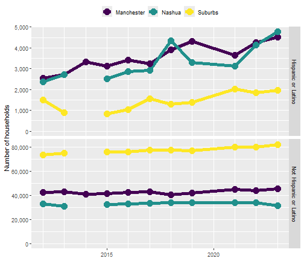

<!-- README.md is generated from README.Rmd. Please edit that file -->

# hercacstables

<!-- badges: start -->
<!-- badges: end -->

## Installation

You can install the development version from
[GitHub](https://github.com/) with:

``` r
# install.packages("devtools")
devtools::install_github("higherX4Racine/hercacstables")
```

## Motivation

The American Community Survey (ACS) from the US Census’s website returns
data in a weirdly idiosyncratic way. There are many subtotals in each
table. Grouping variables are organized in a tree-like, rather than
tabular fashion. This package is intended to make it easy to access and
use the ACS data with R.

Many questions that work with Census data follow a common pattern:

> How did \[measurement\] differ among \[demographic groups\] and across
> \[geographic levels\] in \[geographic area\] during \[span of time\]?

A **Measurement** is any of the huge number of things that the Census
keeps track of. Measurements are arranged in tables (called “groups”)
and rows. If you were drawing maps, this would be what determines the
color of each area. Examples include population size (table B01001 and
others), median household income (table B19013 and others), types of
computers in a household (table B28001), number of vehicles used while
commuting (table B08015).

A **Demographic Group** is a subset of the population that shares
specific traits. Demographic groups can be represented either by groups
(common when reporting by race or ethnicity) or rows (most other cases,
like age, sex, or veteran status). If you were drawing maps, you would
probably have a different version of each map for each demographic
grouping. Examples include the number of Hispanic girls under 5 years
old (table B01001I, row 18), the median income of Asian American
households (table B19013D, row 1), the number of households with no
computer (table B28001, row 11), the number of vehicles used by women
while commuting (table B08015, row 3).

A **Geographic Level** is a [Census-defined
hierarchy](https://www.census.gov/programs-surveys/geography/guidance.html)
from the whole country to small blocks. The level that you are
interested in is determined by the scale of your question. If you were
drawing maps, these would be the areas that appeared as different
colors. Examples include congressional districts, incorporated cities,
school districts, and Census tracts.

A **Geographic Area** is a set of specific instances of one or more
geographic levels. This is the full geographic scope of your question.
If you were drawing maps, this would determine their scale. Examples
include whole states, metropolitan areas, Census-designated places, and
counties.

## The workflow

1.  Identify the groups and rows that contain the data you need
    - Use `hercacstables::METADATA_ACS5` for this!
    - Create a lookup table that maps from the Census variable name to
      your variables.
      - You may need several if you are pulling data from several
        groups.
2.  Define the geographies that you will use
    - Use `hercacstables::METADATA_ACS5` for this, too!
    - You need to know at least two levels of geography:
      - The one that you want to pull data for, your level of interest
        - This is often small, like tract or county subdivision.
      - Any and all levels that contain your level of interest
        - These will be larger, like state or county.
    - Create a lookup table that maps from geographic ids to meaningful
      names.
3.  Write fetching functions that call `hercacstables::fetch_data`
    - they will often always use the same variables (from step 1)
    - they may need to be parameterized by geography if you’re pulling
      from multiple levels
    - they should always be parameterized by year so that you can reuse
      them
4.  Write wrangling functions that for turning fetched tables into
    useful ones.
    - These will probably involve using `dplyr::inner_join` between the
      fetched data and your lookup tables.
    - You can also perform calculations like aggregating or finding
      remainders.
5.  Run the workflow in two stages.
    - Use `purrr::map` and `purrr::list_rbind` to download all of the
      data into one data frame.
      - Cache that result because API calls are slow
    - Run the wrangling functions.
      - Save these results with, e.g. `base::saveRDS`.

## Example

Let’s say you want to ask this question:

> How did \[the number of households\] differ between \[Hispanic and
> non-Hispanic people\] and across \[Manchester, Nashua, and suburban
> areas\] in \[Hillsborough County, NH\] during \[the last 10 years\]?

### find the **measurement** and **demographic groups**

First, find the variables that describe the numbers of households. One
way to do this is to search `hercacstables::METADATA_ACS5` for groups
whose “Universe” is “Households” and whose “Description” contains
“Hispanic” or “Ethnicity.” A group’s “Universe” describes what it is
measuring, often telling you the units of whatever its values are. A
group’s “Description” is a phrase that summarizes what it reports.

``` r
hercacstables::METADATA_ACS5 |>
    purrr::pluck("groups") |>
    dplyr::filter(stringr::str_detect(.data$Universe, "Household"),
                  stringr::str_detect(.data$Description, "Hispanic|Ethnic")) |>
    gt::gt(rowname_col = "Group")
```

<div id="echstzaiwx" style="padding-left:0px;padding-right:0px;padding-top:10px;padding-bottom:10px;overflow-x:auto;overflow-y:auto;width:auto;height:auto;">
<table class="gt_table" data-quarto-disable-processing="false" data-quarto-bootstrap="false">
  <thead>
    <tr class="gt_col_headings">
      <th class="gt_col_heading gt_columns_bottom_border gt_left" rowspan="1" colspan="1" scope="col" id=""></th>
      <th class="gt_col_heading gt_columns_bottom_border gt_left" rowspan="1" colspan="1" scope="col" id="Description">Description</th>
      <th class="gt_col_heading gt_columns_bottom_border gt_left" rowspan="1" colspan="1" scope="col" id="Universe">Universe</th>
    </tr>
  </thead>
  <tbody class="gt_table_body">
    <tr><th id="stub_1_1" scope="row" class="gt_row gt_left gt_stub">B11001H</th>
<td headers="stub_1_1 Description" class="gt_row gt_left">Household Type (Including Living Alone) (White Alone, Not Hispanic or Latino)</td>
<td headers="stub_1_1 Universe" class="gt_row gt_left">Households with a householder who is White alone, not Hispanic or Latino</td></tr>
    <tr><th id="stub_1_2" scope="row" class="gt_row gt_left gt_stub">B11001I</th>
<td headers="stub_1_2 Description" class="gt_row gt_left">Household Type (Including Living Alone) (Hispanic or Latino)</td>
<td headers="stub_1_2 Universe" class="gt_row gt_left">Households with a householder who is Hispanic or Latino</td></tr>
    <tr><th id="stub_1_3" scope="row" class="gt_row gt_left gt_stub">B19001H</th>
<td headers="stub_1_3 Description" class="gt_row gt_left">Household Income in the Past 12 Months (in 2022 Inflation-Adjusted Dollars) (White Alone, Not Hispanic or Latino Householder)</td>
<td headers="stub_1_3 Universe" class="gt_row gt_left">Households with a householder who is White alone, not Hispanic or Latino</td></tr>
    <tr><th id="stub_1_4" scope="row" class="gt_row gt_left gt_stub">B19001I</th>
<td headers="stub_1_4 Description" class="gt_row gt_left">Household Income in the Past 12 Months (in 2022 Inflation-Adjusted Dollars) (Hispanic or Latino Householder)</td>
<td headers="stub_1_4 Universe" class="gt_row gt_left">Households with a householder who is Hispanic or Latino</td></tr>
    <tr><th id="stub_1_5" scope="row" class="gt_row gt_left gt_stub">B19013H</th>
<td headers="stub_1_5 Description" class="gt_row gt_left">Median Household Income in the Past 12 Months (in 2022 Inflation-Adjusted Dollars) (White Alone, Not Hispanic or Latino Householder)</td>
<td headers="stub_1_5 Universe" class="gt_row gt_left">Households with a householder who is White alone, not Hispanic or Latino</td></tr>
    <tr><th id="stub_1_6" scope="row" class="gt_row gt_left gt_stub">B19013I</th>
<td headers="stub_1_6 Description" class="gt_row gt_left">Median Household Income in the Past 12 Months (in 2022 Inflation-Adjusted Dollars) (Hispanic or Latino Householder)</td>
<td headers="stub_1_6 Universe" class="gt_row gt_left">Households with a householder who is Hispanic or Latino</td></tr>
    <tr><th id="stub_1_7" scope="row" class="gt_row gt_left gt_stub">B19025H</th>
<td headers="stub_1_7 Description" class="gt_row gt_left">Aggregate Household Income in the Past 12 Months (in 2022 Inflation-Adjusted Dollars) (White Alone, Not Hispanic or Latino Householder)</td>
<td headers="stub_1_7 Universe" class="gt_row gt_left">Households with a householder who is White alone, not Hispanic or Latino</td></tr>
    <tr><th id="stub_1_8" scope="row" class="gt_row gt_left gt_stub">B19025I</th>
<td headers="stub_1_8 Description" class="gt_row gt_left">Aggregate Household Income in the Past 12 Months (in 2022 Inflation-Adjusted Dollars) (Hispanic or Latino Householder)</td>
<td headers="stub_1_8 Universe" class="gt_row gt_left">Households with a householder who is Hispanic or Latino</td></tr>
    <tr><th id="stub_1_9" scope="row" class="gt_row gt_left gt_stub">B19037H</th>
<td headers="stub_1_9 Description" class="gt_row gt_left">Age of Householder by Household Income in the Past 12 Months (in 2022 Inflation-Adjusted Dollars) (White Alone, Not Hispanic or Latino Householder)</td>
<td headers="stub_1_9 Universe" class="gt_row gt_left">Households with a householder who is White alone, not Hispanic or Latino</td></tr>
    <tr><th id="stub_1_10" scope="row" class="gt_row gt_left gt_stub">B19037I</th>
<td headers="stub_1_10 Description" class="gt_row gt_left">Age of Householder by Household Income in the Past 12 Months (in 2022 Inflation-Adjusted Dollars) (Hispanic or Latino Householder)</td>
<td headers="stub_1_10 Universe" class="gt_row gt_left">Households with a householder who is Hispanic or Latino</td></tr>
    <tr><th id="stub_1_11" scope="row" class="gt_row gt_left gt_stub">B22005H</th>
<td headers="stub_1_11 Description" class="gt_row gt_left">Receipt of Food Stamps/SNAP in the Past 12 Months by Race of Householder (White Alone, Not Hispanic or Latino)</td>
<td headers="stub_1_11 Universe" class="gt_row gt_left">Households with a householder who is White alone, not Hispanic or Latino</td></tr>
    <tr><th id="stub_1_12" scope="row" class="gt_row gt_left gt_stub">B22005I</th>
<td headers="stub_1_12 Description" class="gt_row gt_left">Receipt of Food Stamps/SNAP in the Past 12 Months by Race of Householder (Hispanic or Latino)</td>
<td headers="stub_1_12 Universe" class="gt_row gt_left">Households with a householder who is Hispanic or Latino</td></tr>
  </tbody>
  &#10;  
</table>
</div>

It looks like our best bet is group “B11001I.” It is likely that group
“B11001” contains counts of households of any race. The first row of
most groups is the total value across any demographic subset that it
keeps track of. Since our question does not ask about different
household types, we probably just need row one from groups “B11001” and
“B11001I.” This gives us a good opportunity to document the ethnicities
counted in each.

``` r
HOUSEHOLD_GROUPS <- c("B11001", "B11001I")
household_variables <- hercacstables::METADATA_ACS5 |>
    purrr::pluck("variables") |>
    dplyr::filter(.data$Group %in% HOUSEHOLD_GROUPS,
                  .data$Index == 1) |>
    dplyr::mutate(
        Ethnicity = dplyr::case_match(.data$Group,
                                      "B11001" ~ "All",
                                      "B11001I" ~ "Hispanic or Latino")
    ) |>
    dplyr::select("Group", "Index", "Variable", "Ethnicity")

household_variables |>
    gt::gt(rowname_col = "Group") |>
    gt::cols_align(
        "right",
        columns = tidyselect::where(is.numeric)
    )
```

<div id="xddychpurs" style="padding-left:0px;padding-right:0px;padding-top:10px;padding-bottom:10px;overflow-x:auto;overflow-y:auto;width:auto;height:auto;">
<table class="gt_table" data-quarto-disable-processing="false" data-quarto-bootstrap="false">
  <thead>
    <tr class="gt_col_headings">
      <th class="gt_col_heading gt_columns_bottom_border gt_left" rowspan="1" colspan="1" scope="col" id=""></th>
      <th class="gt_col_heading gt_columns_bottom_border gt_right" rowspan="1" colspan="1" scope="col" id="Index">Index</th>
      <th class="gt_col_heading gt_columns_bottom_border gt_left" rowspan="1" colspan="1" scope="col" id="Variable">Variable</th>
      <th class="gt_col_heading gt_columns_bottom_border gt_left" rowspan="1" colspan="1" scope="col" id="Ethnicity">Ethnicity</th>
    </tr>
  </thead>
  <tbody class="gt_table_body">
    <tr><th id="stub_1_1" scope="row" class="gt_row gt_left gt_stub">B11001I</th>
<td headers="stub_1_1 Index" class="gt_row gt_right">1</td>
<td headers="stub_1_1 Variable" class="gt_row gt_left">B11001I_001E</td>
<td headers="stub_1_1 Ethnicity" class="gt_row gt_left">Hispanic or Latino</td></tr>
    <tr><th id="stub_1_2" scope="row" class="gt_row gt_left gt_stub">B11001</th>
<td headers="stub_1_2 Index" class="gt_row gt_right">1</td>
<td headers="stub_1_2 Variable" class="gt_row gt_left">B11001_001E</td>
<td headers="stub_1_2 Ethnicity" class="gt_row gt_left">All</td></tr>
  </tbody>
  &#10;  
</table>
</div>

### find the **geographic levels** and **geographic area**

The next step is to [find the
codes](https://www.census.gov/library/reference/code-lists/ansi.html)
that are related to the geographic areas and levels. We need to know the
FIPS code for the state, county, and two cities. We also need to know
that the geographic level that we’re working with is “county
subdivision.” As the last part of this step, we define a lookup table to
translate from the FIPS codes for the different geographies to a
human-readable name.

``` r
NEW_HAMPSHIRE <- "33"
COUNTY_LEVEL <- "county"
HILLSBOROUGH_CO <- "011"
CITY_LEVEL <- "county subdivision"
MANCHESTER_NH <- "45140"
NASHUA_NH <- "50260"

geography_definitions <- tibble::tribble(
    ~ FIPS,          ~ Location,
    HILLSBOROUGH_CO, "County-wide",
    MANCHESTER_NH,   "Manchester",
    NASHUA_NH,       "Nashua"
)
```

### find the **time interval**

The last ten years available from the Census are, as of 2024-09-13, 2012
through 2022. We can use 1-year estimates for our question because we
are dealing with geographic levels that have more than 50,000 people in
them. That gives us more year-to-year precision, although it does mean
that we have to exclude 2020. There are no 1-year ACS estimates for 2020
because of the COVID-19 pandemic.

``` r
YEARS_INCLUDED <- c(2012:2019, 2021:2022)
```

### define functions that use the API

We will need to make multiple calls to the API, so it makes sense to
create some reusable functions. We need two calls per year. The first
one will pull the county-wide household counts. The second one will pull
the household counts for each city. Each function should have “year” as
its argument so that we can reuse it.

``` r
generalized_fetch_data <- function(.year, .level, .areas, ...) {
    hercacstables::fetch_data(
        variables = household_variables$Variable,
        year = .year,
        survey_type = "acs",
        table_or_survey_code = "acs1",
        for_geo = .level,
        for_items = .areas,
        state = NEW_HAMPSHIRE,
        ...
    )
}

fetch_county_households <- function(.year){
    generalized_fetch_data(.year,
                           "county",
                           HILLSBOROUGH_CO)
}

fetch_city_households <- function(.year){
    generalized_fetch_data(.year,
                           CITY_LEVEL,
                           c(MANCHESTER_NH,
                             NASHUA_NH),
                           county = HILLSBOROUGH_CO)
}

fetch_example_data <- function(.year) {
    dplyr::bind_rows(
        fetch_county_households(.year),
        fetch_city_households(.year)
    )
}
```

### fetch the data

This is where `hercacstables` starts to come into its own. We define the
fetching process as few times as possible, just tweaking it for related
cases. This leads to a lot of code reuse and efficiency, especially for
reports that you just need to update once a year.

``` r
raw_households <- YEARS_INCLUDED |>
    purrr::map(fetch_example_data) |>
    purrr::list_rbind()
```

``` r
raw_households |>
    dplyr::filter(.data$Year == 2022) |>
    gt::gt() |>
    gt::fmt_integer(columns = "Value") |>
    gt::cols_align(
        "right",
        columns = tidyselect::where(is.numeric)
    )
```

<div id="tlihfpykpp" style="padding-left:0px;padding-right:0px;padding-top:10px;padding-bottom:10px;overflow-x:auto;overflow-y:auto;width:auto;height:auto;">
<table class="gt_table" data-quarto-disable-processing="false" data-quarto-bootstrap="false">
  <thead>
    <tr class="gt_col_headings">
      <th class="gt_col_heading gt_columns_bottom_border gt_right" rowspan="1" colspan="1" scope="col" id="state">state</th>
      <th class="gt_col_heading gt_columns_bottom_border gt_right" rowspan="1" colspan="1" scope="col" id="county">county</th>
      <th class="gt_col_heading gt_columns_bottom_border gt_left" rowspan="1" colspan="1" scope="col" id="Group">Group</th>
      <th class="gt_col_heading gt_columns_bottom_border gt_right" rowspan="1" colspan="1" scope="col" id="Index">Index</th>
      <th class="gt_col_heading gt_columns_bottom_border gt_right" rowspan="1" colspan="1" scope="col" id="Value">Value</th>
      <th class="gt_col_heading gt_columns_bottom_border gt_right" rowspan="1" colspan="1" scope="col" id="Year">Year</th>
      <th class="gt_col_heading gt_columns_bottom_border gt_right" rowspan="1" colspan="1" scope="col" id="county subdivision">county subdivision</th>
    </tr>
  </thead>
  <tbody class="gt_table_body">
    <tr><td headers="state" class="gt_row gt_right">33</td>
<td headers="county" class="gt_row gt_right">011</td>
<td headers="Group" class="gt_row gt_left">B11001I</td>
<td headers="Index" class="gt_row gt_right">1</td>
<td headers="Value" class="gt_row gt_right">10,250</td>
<td headers="Year" class="gt_row gt_right">2022</td>
<td headers="county subdivision" class="gt_row gt_right">NA</td></tr>
    <tr><td headers="state" class="gt_row gt_right">33</td>
<td headers="county" class="gt_row gt_right">011</td>
<td headers="Group" class="gt_row gt_left">B11001</td>
<td headers="Index" class="gt_row gt_right">1</td>
<td headers="Value" class="gt_row gt_right">167,816</td>
<td headers="Year" class="gt_row gt_right">2022</td>
<td headers="county subdivision" class="gt_row gt_right">NA</td></tr>
    <tr><td headers="state" class="gt_row gt_right">33</td>
<td headers="county" class="gt_row gt_right">011</td>
<td headers="Group" class="gt_row gt_left">B11001I</td>
<td headers="Index" class="gt_row gt_right">1</td>
<td headers="Value" class="gt_row gt_right">4,251</td>
<td headers="Year" class="gt_row gt_right">2022</td>
<td headers="county subdivision" class="gt_row gt_right">45140</td></tr>
    <tr><td headers="state" class="gt_row gt_right">33</td>
<td headers="county" class="gt_row gt_right">011</td>
<td headers="Group" class="gt_row gt_left">B11001</td>
<td headers="Index" class="gt_row gt_right">1</td>
<td headers="Value" class="gt_row gt_right">48,068</td>
<td headers="Year" class="gt_row gt_right">2022</td>
<td headers="county subdivision" class="gt_row gt_right">45140</td></tr>
    <tr><td headers="state" class="gt_row gt_right">33</td>
<td headers="county" class="gt_row gt_right">011</td>
<td headers="Group" class="gt_row gt_left">B11001I</td>
<td headers="Index" class="gt_row gt_right">1</td>
<td headers="Value" class="gt_row gt_right">4,155</td>
<td headers="Year" class="gt_row gt_right">2022</td>
<td headers="county subdivision" class="gt_row gt_right">50260</td></tr>
    <tr><td headers="state" class="gt_row gt_right">33</td>
<td headers="county" class="gt_row gt_right">011</td>
<td headers="Group" class="gt_row gt_left">B11001</td>
<td headers="Index" class="gt_row gt_right">1</td>
<td headers="Value" class="gt_row gt_right">38,017</td>
<td headers="Year" class="gt_row gt_right">2022</td>
<td headers="county subdivision" class="gt_row gt_right">50260</td></tr>
  </tbody>
  &#10;  
</table>
</div>

### wrangle the data

The raw data are not very usable. Several of the columns still have
codes, rather than human-readable values. The value column also does not
explicitly state values for the suburban or for non-Hispanic folks. The
“wrangling” process is where we addressing these drawbacks.

#### map codes to words

We should get rid of the columns that are Census database codes and
create columns about location and demographics that have human-readable
values.

``` r
households <- raw_households |>
    dplyr::inner_join(
        household_variables,
        by = c("Group", "Index")
    ) |>
    dplyr::mutate(
        FIPS = dplyr::coalesce(.data$`county subdivision`,
                               .data$county)
    ) |>
    dplyr::inner_join(
        geography_definitions,
        by = "FIPS"
    ) |>
    dplyr::select(
        "Location",
        "Year",
        "Ethnicity",
        Households = "Value"
    )

households |>
    dplyr::filter(.data$Year == 2022) |>
    gt::gt() |>
    gt::fmt_integer(columns = "Households") |>
    gt::cols_align(
        "right",
        columns = tidyselect::where(is.numeric)
    )
```

<div id="udukjaziph" style="padding-left:0px;padding-right:0px;padding-top:10px;padding-bottom:10px;overflow-x:auto;overflow-y:auto;width:auto;height:auto;">
<table class="gt_table" data-quarto-disable-processing="false" data-quarto-bootstrap="false">
  <thead>
    <tr class="gt_col_headings">
      <th class="gt_col_heading gt_columns_bottom_border gt_left" rowspan="1" colspan="1" scope="col" id="Location">Location</th>
      <th class="gt_col_heading gt_columns_bottom_border gt_right" rowspan="1" colspan="1" scope="col" id="Year">Year</th>
      <th class="gt_col_heading gt_columns_bottom_border gt_left" rowspan="1" colspan="1" scope="col" id="Ethnicity">Ethnicity</th>
      <th class="gt_col_heading gt_columns_bottom_border gt_right" rowspan="1" colspan="1" scope="col" id="Households">Households</th>
    </tr>
  </thead>
  <tbody class="gt_table_body">
    <tr><td headers="Location" class="gt_row gt_left">County-wide</td>
<td headers="Year" class="gt_row gt_right">2022</td>
<td headers="Ethnicity" class="gt_row gt_left">Hispanic or Latino</td>
<td headers="Households" class="gt_row gt_right">10,250</td></tr>
    <tr><td headers="Location" class="gt_row gt_left">County-wide</td>
<td headers="Year" class="gt_row gt_right">2022</td>
<td headers="Ethnicity" class="gt_row gt_left">All</td>
<td headers="Households" class="gt_row gt_right">167,816</td></tr>
    <tr><td headers="Location" class="gt_row gt_left">Manchester</td>
<td headers="Year" class="gt_row gt_right">2022</td>
<td headers="Ethnicity" class="gt_row gt_left">Hispanic or Latino</td>
<td headers="Households" class="gt_row gt_right">4,251</td></tr>
    <tr><td headers="Location" class="gt_row gt_left">Manchester</td>
<td headers="Year" class="gt_row gt_right">2022</td>
<td headers="Ethnicity" class="gt_row gt_left">All</td>
<td headers="Households" class="gt_row gt_right">48,068</td></tr>
    <tr><td headers="Location" class="gt_row gt_left">Nashua</td>
<td headers="Year" class="gt_row gt_right">2022</td>
<td headers="Ethnicity" class="gt_row gt_left">Hispanic or Latino</td>
<td headers="Households" class="gt_row gt_right">4,155</td></tr>
    <tr><td headers="Location" class="gt_row gt_left">Nashua</td>
<td headers="Year" class="gt_row gt_right">2022</td>
<td headers="Ethnicity" class="gt_row gt_left">All</td>
<td headers="Households" class="gt_row gt_right">38,017</td></tr>
  </tbody>
  &#10;  
</table>
</div>

#### compute implicit values

Now that the columns are human-readable, we can compute the values that
we are actually interested in. That computation involves subtracting
either the cities’ households from the county’s, or the number of
Hispanic households from the total number of households. This task turns
up very frequently when dealing with Census data, so the package
includes a helper function to do it for you:
`hercacstables::subtract_parts_from_whole`. That function does not
remove the rows that contain the all-groups category. In our case, we
must remove them so all of the calculations come out correctly.

``` r
households <- households |>
    hercacstables::subtract_parts_from_whole(
        grouping_column = "Location",
        value_column = "Households",
        whole_name = "County-wide",
        part_names = c("Manchester", "Nashua"),
        remainder_name = "Suburbs"
    ) |>
    dplyr::select(
        !"County-wide"
    ) |>
    hercacstables::subtract_parts_from_whole(
        grouping_column = "Ethnicity",
        value_column = "Households",
        whole_name = "All",
        part_names = "Hispanic or Latino",
        remainder_name = "Not Hispanic or Latino"
    ) |>
    dplyr::select(
        !"All"
    )

households |>
    dplyr::filter(.data$Year == 2022) |>
    gt::gt() |>
    gt::fmt_integer(columns = "Households")
```

<div id="ngohnsunmk" style="padding-left:0px;padding-right:0px;padding-top:10px;padding-bottom:10px;overflow-x:auto;overflow-y:auto;width:auto;height:auto;">

<table class="gt_table" data-quarto-disable-processing="false" data-quarto-bootstrap="false">
  <thead>
    <tr class="gt_col_headings">
      <th class="gt_col_heading gt_columns_bottom_border gt_right" rowspan="1" colspan="1" scope="col" id="Year">Year</th>
      <th class="gt_col_heading gt_columns_bottom_border gt_left" rowspan="1" colspan="1" scope="col" id="Location">Location</th>
      <th class="gt_col_heading gt_columns_bottom_border gt_left" rowspan="1" colspan="1" scope="col" id="Ethnicity">Ethnicity</th>
      <th class="gt_col_heading gt_columns_bottom_border gt_right" rowspan="1" colspan="1" scope="col" id="Households">Households</th>
    </tr>
  </thead>
  <tbody class="gt_table_body">
    <tr><td headers="Year" class="gt_row gt_right">2022</td>
<td headers="Location" class="gt_row gt_left">Manchester</td>
<td headers="Ethnicity" class="gt_row gt_left">Hispanic or Latino</td>
<td headers="Households" class="gt_row gt_right">4,251</td></tr>
    <tr><td headers="Year" class="gt_row gt_right">2022</td>
<td headers="Location" class="gt_row gt_left">Manchester</td>
<td headers="Ethnicity" class="gt_row gt_left">Not Hispanic or Latino</td>
<td headers="Households" class="gt_row gt_right">43,817</td></tr>
    <tr><td headers="Year" class="gt_row gt_right">2022</td>
<td headers="Location" class="gt_row gt_left">Nashua</td>
<td headers="Ethnicity" class="gt_row gt_left">Hispanic or Latino</td>
<td headers="Households" class="gt_row gt_right">4,155</td></tr>
    <tr><td headers="Year" class="gt_row gt_right">2022</td>
<td headers="Location" class="gt_row gt_left">Nashua</td>
<td headers="Ethnicity" class="gt_row gt_left">Not Hispanic or Latino</td>
<td headers="Households" class="gt_row gt_right">33,862</td></tr>
    <tr><td headers="Year" class="gt_row gt_right">2022</td>
<td headers="Location" class="gt_row gt_left">Suburbs</td>
<td headers="Ethnicity" class="gt_row gt_left">Hispanic or Latino</td>
<td headers="Households" class="gt_row gt_right">1,844</td></tr>
    <tr><td headers="Year" class="gt_row gt_right">2022</td>
<td headers="Location" class="gt_row gt_left">Suburbs</td>
<td headers="Ethnicity" class="gt_row gt_left">Not Hispanic or Latino</td>
<td headers="Households" class="gt_row gt_right">79,887</td></tr>
  </tbody>
  &#10;  
</table>
</div>

### Answer the question

Now we can finally look at trends in number of households in
Hillsborough County, NH, comparing between Hispanic and non-Hispanic
households among Manchester, Nashua, and the suburbs.

#### visualize

The first step is to make some graphs. These data are 4-dimensional
because they involve time, location, ethnicity, and number of
households. That means we’ll need more than one graph. It looked from
the tables above that the number of Hispanic households is much lower
than non-Hispanic households in all three locations. Let’s make a
two-panel graph, where each panel shows one ethnicity. That way they can
have separate y axes. Both graphs will have time on the x-axis, number
of households on the y, and designate location with the color of points
and lines.

``` r
households |>
    ggplot2::ggplot(
        ggplot2::aes(
            x = .data$Year,
            y = .data$Households,
            color = .data$Location,
            group = .data$Location
        )
    ) +
    ggplot2::geom_line(
        linewidth = 2
    ) +
    ggplot2::geom_point(
        size = 5
    ) +
    ggplot2::scale_x_continuous(
        name = NULL,
        breaks = scales::breaks_width(5),
        minor_breaks = scales::breaks_width(1)
    ) +
    ggplot2::scale_y_continuous(
        name = "Number of households",
        limits = c(0, NA),
        labels = scales::label_comma(accuracy = 1)
    ) +
    ggplot2::scale_color_viridis_d(
        name = NULL,
        guide = ggplot2::guide_legend(position = "top")
    ) +
    ggplot2::facet_grid(
        rows = ggplot2::vars(.data$Ethnicity),
        scales = "free_y"
    )
```



It looks like the number of households is growing, with non-Hispanic
households increasing in the suburbs and Hispanic households increasing
in the cities.

#### analyze

Let’s test this with an ANCOVA. We’ll subtract 2012 from the year so
that the intercept estimate gives us the value in 2012, not AD 0.

``` r
household_model <- households |>
    dplyr::mutate(
        Year = .data$Year - 2012,
        Location = factor(.data$Location,
                          levels = c("Suburbs",
                                     "Manchester",
                                     "Nashua")),
        Ethnicity = factor(.data$Ethnicity,
                           levels = c("Not Hispanic or Latino",
                                      "Hispanic or Latino"))
    ) |>
    lm(Households ~ Year * Ethnicity * Location,
       data = _)
```

I always like to look at the ANOVA table first to get a 10,000 meter
view before I try to interpret specific parameters.

``` r
household_model |>
    anova() |>
    broom::tidy() |>
    gt::gt() |>
    gt::fmt_engineering(columns = c("sumsq",
                                    "meansq")) |>
    gt::fmt_number(columns = "statistic",
                   n_sigfig = 4) |>
    gt::fmt_number(columns = "p.value",
                   decimals = 4) |>
    gt::cols_align(
        "right",
        columns = tidyselect::where(is.numeric)
    ) |>
    gt::cols_align_decimal(
        "p.value"
    )
```

<div id="qtbjupwykc" style="padding-left:0px;padding-right:0px;padding-top:10px;padding-bottom:10px;overflow-x:auto;overflow-y:auto;width:auto;height:auto;">
<table class="gt_table" data-quarto-disable-processing="false" data-quarto-bootstrap="false">
  <thead>
    <tr class="gt_col_headings">
      <th class="gt_col_heading gt_columns_bottom_border gt_left" rowspan="1" colspan="1" scope="col" id="term">term</th>
      <th class="gt_col_heading gt_columns_bottom_border gt_right" rowspan="1" colspan="1" scope="col" id="df">df</th>
      <th class="gt_col_heading gt_columns_bottom_border gt_right" rowspan="1" colspan="1" scope="col" id="sumsq">sumsq</th>
      <th class="gt_col_heading gt_columns_bottom_border gt_right" rowspan="1" colspan="1" scope="col" id="meansq">meansq</th>
      <th class="gt_col_heading gt_columns_bottom_border gt_right" rowspan="1" colspan="1" scope="col" id="statistic">statistic</th>
      <th class="gt_col_heading gt_columns_bottom_border gt_right" rowspan="1" colspan="1" scope="col" id="p.value">p.value</th>
    </tr>
  </thead>
  <tbody class="gt_table_body">
    <tr><td headers="term" class="gt_row gt_left">Year</td>
<td headers="df" class="gt_row gt_right">1</td>
<td headers="sumsq" class="gt_row gt_right">42.87&nbsp;×&nbsp;10<sup style='font-size: 65%;'>6</sup></td>
<td headers="meansq" class="gt_row gt_right">42.87&nbsp;×&nbsp;10<sup style='font-size: 65%;'>6</sup></td>
<td headers="statistic" class="gt_row gt_right">83.89</td>
<td headers="p.value" class="gt_row gt_right">0.0000</td></tr>
    <tr><td headers="term" class="gt_row gt_left">Ethnicity</td>
<td headers="df" class="gt_row gt_right">1</td>
<td headers="sumsq" class="gt_row gt_right">32.10&nbsp;×&nbsp;10<sup style='font-size: 65%;'>9</sup></td>
<td headers="meansq" class="gt_row gt_right">32.10&nbsp;×&nbsp;10<sup style='font-size: 65%;'>9</sup></td>
<td headers="statistic" class="gt_row gt_right">62,820</td>
<td headers="p.value" class="gt_row gt_right">0.0000</td></tr>
    <tr><td headers="term" class="gt_row gt_left">Location</td>
<td headers="df" class="gt_row gt_right">2</td>
<td headers="sumsq" class="gt_row gt_right">4.38&nbsp;×&nbsp;10<sup style='font-size: 65%;'>9</sup></td>
<td headers="meansq" class="gt_row gt_right">2.19&nbsp;×&nbsp;10<sup style='font-size: 65%;'>9</sup></td>
<td headers="statistic" class="gt_row gt_right">4,281</td>
<td headers="p.value" class="gt_row gt_right">0.0000</td></tr>
    <tr><td headers="term" class="gt_row gt_left">Year:Ethnicity</td>
<td headers="df" class="gt_row gt_right">1</td>
<td headers="sumsq" class="gt_row gt_right">13.47&nbsp;×&nbsp;10<sup style='font-size: 65%;'>6</sup></td>
<td headers="meansq" class="gt_row gt_right">13.47&nbsp;×&nbsp;10<sup style='font-size: 65%;'>6</sup></td>
<td headers="statistic" class="gt_row gt_right">26.36</td>
<td headers="p.value" class="gt_row gt_right">0.0000</td></tr>
    <tr><td headers="term" class="gt_row gt_left">Year:Location</td>
<td headers="df" class="gt_row gt_right">2</td>
<td headers="sumsq" class="gt_row gt_right">4.04&nbsp;×&nbsp;10<sup style='font-size: 65%;'>6</sup></td>
<td headers="meansq" class="gt_row gt_right">2.02&nbsp;×&nbsp;10<sup style='font-size: 65%;'>6</sup></td>
<td headers="statistic" class="gt_row gt_right">3.948</td>
<td headers="p.value" class="gt_row gt_right">0.0265</td></tr>
    <tr><td headers="term" class="gt_row gt_left">Ethnicity:Location</td>
<td headers="df" class="gt_row gt_right">2</td>
<td headers="sumsq" class="gt_row gt_right">5.27&nbsp;×&nbsp;10<sup style='font-size: 65%;'>9</sup></td>
<td headers="meansq" class="gt_row gt_right">2.64&nbsp;×&nbsp;10<sup style='font-size: 65%;'>9</sup></td>
<td headers="statistic" class="gt_row gt_right">5,157</td>
<td headers="p.value" class="gt_row gt_right">0.0000</td></tr>
    <tr><td headers="term" class="gt_row gt_left">Year:Ethnicity:Location</td>
<td headers="df" class="gt_row gt_right">2</td>
<td headers="sumsq" class="gt_row gt_right">7.72&nbsp;×&nbsp;10<sup style='font-size: 65%;'>6</sup></td>
<td headers="meansq" class="gt_row gt_right">3.86&nbsp;×&nbsp;10<sup style='font-size: 65%;'>6</sup></td>
<td headers="statistic" class="gt_row gt_right">7.551</td>
<td headers="p.value" class="gt_row gt_right">0.0015</td></tr>
    <tr><td headers="term" class="gt_row gt_left">Residuals</td>
<td headers="df" class="gt_row gt_right">44</td>
<td headers="sumsq" class="gt_row gt_right">22.49&nbsp;×&nbsp;10<sup style='font-size: 65%;'>6</sup></td>
<td headers="meansq" class="gt_row gt_right">511.04&nbsp;×&nbsp;10<sup style='font-size: 65%;'>3</sup></td>
<td headers="statistic" class="gt_row gt_right">NA</td>
<td headers="p.value" class="gt_row gt_right">NA</td></tr>
  </tbody>
  &#10;  
</table>
</div>

It looks like EVERYTHING is significant, so let’s look at all of the
parameters that were in the near-significant range.

``` r
household_model |>
    broom::tidy() |>
    dplyr::filter(
        .data$`p.value` < 0.1
    ) |>
    gt::gt() |>
    gt::fmt_number(
        columns = c("estimate",
                    "std.error",
                    "statistic"),
        n_sigfig = 4
    ) |>
    gt::fmt_number(
        columns = "p.value",
        decimals = 4
    ) |>
    gt::cols_align(
        "right",
        columns = tidyselect::where(is.numeric)
    ) |>
    gt::cols_align_decimal(
        "p.value"
    )
```

<div id="cuapmjhdmh" style="padding-left:0px;padding-right:0px;padding-top:10px;padding-bottom:10px;overflow-x:auto;overflow-y:auto;width:auto;height:auto;">
<table class="gt_table" data-quarto-disable-processing="false" data-quarto-bootstrap="false">
  <thead>
    <tr class="gt_col_headings">
      <th class="gt_col_heading gt_columns_bottom_border gt_left" rowspan="1" colspan="1" scope="col" id="term">term</th>
      <th class="gt_col_heading gt_columns_bottom_border gt_right" rowspan="1" colspan="1" scope="col" id="estimate">estimate</th>
      <th class="gt_col_heading gt_columns_bottom_border gt_right" rowspan="1" colspan="1" scope="col" id="std.error">std.error</th>
      <th class="gt_col_heading gt_columns_bottom_border gt_right" rowspan="1" colspan="1" scope="col" id="statistic">statistic</th>
      <th class="gt_col_heading gt_columns_bottom_border gt_right" rowspan="1" colspan="1" scope="col" id="p.value">p.value</th>
    </tr>
  </thead>
  <tbody class="gt_table_body">
    <tr><td headers="term" class="gt_row gt_left">(Intercept)</td>
<td headers="estimate" class="gt_row gt_right">73,790</td>
<td headers="std.error" class="gt_row gt_right">442.3</td>
<td headers="statistic" class="gt_row gt_right">166.8</td>
<td headers="p.value" class="gt_row gt_right">0.0000</td></tr>
    <tr><td headers="term" class="gt_row gt_left">Year</td>
<td headers="estimate" class="gt_row gt_right">632.6</td>
<td headers="std.error" class="gt_row gt_right">74.53</td>
<td headers="statistic" class="gt_row gt_right">8.488</td>
<td headers="p.value" class="gt_row gt_right">0.0000</td></tr>
    <tr><td headers="term" class="gt_row gt_left">EthnicityHispanic or Latino</td>
<td headers="estimate" class="gt_row gt_right">−72,830</td>
<td headers="std.error" class="gt_row gt_right">625.5</td>
<td headers="statistic" class="gt_row gt_right">−116.4</td>
<td headers="p.value" class="gt_row gt_right">0.0000</td></tr>
    <tr><td headers="term" class="gt_row gt_left">LocationManchester</td>
<td headers="estimate" class="gt_row gt_right">−32,160</td>
<td headers="std.error" class="gt_row gt_right">599.6</td>
<td headers="statistic" class="gt_row gt_right">−53.63</td>
<td headers="p.value" class="gt_row gt_right">0.0000</td></tr>
    <tr><td headers="term" class="gt_row gt_left">LocationNashua</td>
<td headers="estimate" class="gt_row gt_right">−41,770</td>
<td headers="std.error" class="gt_row gt_right">625.5</td>
<td headers="statistic" class="gt_row gt_right">−66.77</td>
<td headers="p.value" class="gt_row gt_right">0.0000</td></tr>
    <tr><td headers="term" class="gt_row gt_left">Year:EthnicityHispanic or Latino</td>
<td headers="estimate" class="gt_row gt_right">−550.1</td>
<td headers="std.error" class="gt_row gt_right">105.4</td>
<td headers="statistic" class="gt_row gt_right">−5.219</td>
<td headers="p.value" class="gt_row gt_right">0.0000</td></tr>
    <tr><td headers="term" class="gt_row gt_left">Year:LocationManchester</td>
<td headers="estimate" class="gt_row gt_right">−449.6</td>
<td headers="std.error" class="gt_row gt_right">103.2</td>
<td headers="statistic" class="gt_row gt_right">−4.355</td>
<td headers="p.value" class="gt_row gt_right">0.0001</td></tr>
    <tr><td headers="term" class="gt_row gt_left">Year:LocationNashua</td>
<td headers="estimate" class="gt_row gt_right">−402.7</td>
<td headers="std.error" class="gt_row gt_right">105.4</td>
<td headers="statistic" class="gt_row gt_right">−3.821</td>
<td headers="p.value" class="gt_row gt_right">0.0004</td></tr>
    <tr><td headers="term" class="gt_row gt_left">EthnicityHispanic or Latino:LocationManchester</td>
<td headers="estimate" class="gt_row gt_right">33,920</td>
<td headers="std.error" class="gt_row gt_right">848.0</td>
<td headers="statistic" class="gt_row gt_right">40.00</td>
<td headers="p.value" class="gt_row gt_right">0.0000</td></tr>
    <tr><td headers="term" class="gt_row gt_left">EthnicityHispanic or Latino:LocationNashua</td>
<td headers="estimate" class="gt_row gt_right">43,220</td>
<td headers="std.error" class="gt_row gt_right">884.6</td>
<td headers="statistic" class="gt_row gt_right">48.85</td>
<td headers="p.value" class="gt_row gt_right">0.0000</td></tr>
    <tr><td headers="term" class="gt_row gt_left">Year:EthnicityHispanic or Latino:LocationManchester</td>
<td headers="estimate" class="gt_row gt_right">521.9</td>
<td headers="std.error" class="gt_row gt_right">146.0</td>
<td headers="statistic" class="gt_row gt_right">3.575</td>
<td headers="p.value" class="gt_row gt_right">0.0009</td></tr>
    <tr><td headers="term" class="gt_row gt_left">Year:EthnicityHispanic or Latino:LocationNashua</td>
<td headers="estimate" class="gt_row gt_right">467.4</td>
<td headers="std.error" class="gt_row gt_right">149.1</td>
<td headers="statistic" class="gt_row gt_right">3.135</td>
<td headers="p.value" class="gt_row gt_right">0.0031</td></tr>
  </tbody>
  &#10;  
</table>
</div>

#### summarize

The number of households in Hillsborough county overall grew from
2012-2022. The number of Hispanic households was much higher in the two
cities than in the suburban parts of the county. This difference became
more pronounced over the decade, for two reasons. The number of Hispanic
households grew more quickly in Nashua and Manchester than in the
suburban areas. The number of non-Hispanic households grew more quickly
in the suburbs than in the cities. Isn’t it nice when the visual
patterns are corroborated by significant statistics?
