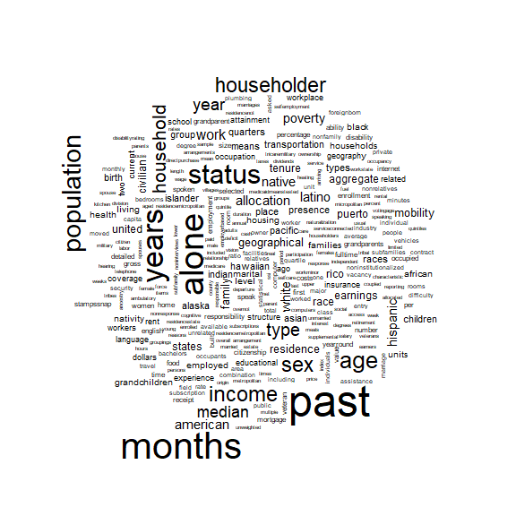

<!-- README.md is generated from README.Rmd. Please edit that file -->

# hercacstables

<!-- badges: start -->
<!-- badges: end -->

If this is your first time using `hercacstables` then you probably want
to register with the Census. The Census limits the number of anonymous
API queries that it receives from any one IP address. Check out
`vignette("set-up-your-api-key", package = "hercacstables")`.

Otherwise, welcome back!

## For the newest R users:

You may be new to R, but not data science, in which case I suggest
checking out [R for Data Science](https://r4ds.hadley.nz/intro.html). If
you’re not coming from a data science perspective, I have heard good
things about [this book](https://datascienceineducation.com/).

## Installation

You can install the development version from
[GitHub](https://github.com/) with:

``` r
# install.packages("devtools")
devtools::install_github("higherX4Racine/hercacstables")
```

## Motivation

The American Community Survey (ACS) from the US Census’s website
provides a vast amount of useful data.

<figure>

<figcaption aria-hidden="true">A wordcloud made from the Census’
descriptions of its ACS groups</figcaption>
</figure>

However, it returns those data in a weirdly idiosyncratic way. Even
though the output seems tabular, the data are really organized in a
tree-like fashion. This package is intended to make it easy to access
and use the ACS data with R.

## Example

Let’s say that you are a data intern for a [wastewater
agency](https://cityofracine.org/WasteWater/Commission/) in the
southeastern part of Wisconsin. Your mentors have asked you to find
insights from the American Community Survey.

### Specifying your community

They tell you that the wastewater commission’s area of responsibility is
essentially identical to the local school district’s, [Racine
Unified](https://www.rusd.org).

You look for geographical levels related to schools in
`hercacstables::ACS_GEOGRAPHY_METADATA`.

``` r
SCHOOL_GEOGRAPHIES <- dplyr::filter(hercacstables::ACS_GEOGRAPHY_METADATA,
                                    grepl("school", .data$`Geographic Level`))
```

This table tells us two things. First, he geographic level that you
should examine is “school district (unified)”. Second, you also need to
specify the state when you’re fetching data about it. With
`hercacstables::fetch_data()`, and tools from the
[tidyverse](https://www.tidyverse.org "The tidyverse"), you can find the
FIPS codes for unified school districts in Wisconsin that have the word
“Racine” in them.

``` r
RACINE_DISTRICTS <- "NAME" |>
    hercacstables::fetch_data(
        variables = _,
        year = 2020,                           # the most recent decennial
        for_geo = "school district (unified)", # see above
        for_items = "*",                       # this wildcard gets every item
        survey_type = "dec",                   # not actually the ACS *flex*
        table_or_survey_code = "pl",           # this data set is similar to ACS
        state = 55L                            # the Badger State
    ) |>
    dplyr::filter(
        stringr::str_detect(.data$NAME, "Racine")
    )
```

| NAME                              | state | school district (unified) | Year |
|:----------------------------------|:------|:--------------------------|-----:|
| Racine School District, Wisconsin | 55    | 12360                     | 2020 |

### Finding relevant data

The first thing that you could do is to check for data related to
plumbing. If you were doing this without R, you might visit
[](data.census.gov) and search for “ACS plumbing”.

#### Groups with relevant data

With `hercacstables`, you would search within its metadata about ACS
groups:

``` r
PLUMBING_GROUPS <- hercacstables::ACS_GROUP_METADATA |>
    dplyr::filter(
        grepl("plumbing",          # search for the term "plumbing"
              .data$Description,  # within the "Description" column
              ignore.case = TRUE) # ignore capitalization
    )
```

| Group | Universe | Description | ACS1 | ACS5 |
|:---|:---|:---|:---|:---|
| B25016 | Occupied housing units | Tenure by Plumbing Facilities by Occupants per Room | TRUE | TRUE |
| B25047 | Housing units | Plumbing Facilities for All Housing Units | TRUE | TRUE |
| B25048 | Occupied housing units | Plumbing Facilities for Occupied Housing Units | TRUE | TRUE |
| B25049 | Occupied housing units | Tenure by Plumbing Facilities | TRUE | TRUE |
| B25050 | Occupied housing units | Plumbing Facilities by Occupants per Room by Year Structure Built | TRUE | TRUE |
| B99259 | Housing units | Allocation of Plumbing Facilities | TRUE | TRUE |

It appears that the keyword “plumbing” appears in 6 different ACS
groups.

### Specific variables about plumbing

Let’s say that “Tenure[^1] by plumbing facilities” jumps out to you as
potentially interesting.

``` r
GROUP <- "B25049"
```

There is metadata in `hercacstables` about variables, too. You can use
search it to see what specific data is reported by group B25049.

``` r
PLUMBING_VARIABLES <- hercacstables::ACS_VARIABLE_METADATA |>
    dplyr::filter(
        .data$Dataset == "ACS1", # use the 1-year dataset only
        .data$Group == GROUP     # pull all of the variables for this group
    )
```

| Dataset | Group | Index | Variable | Details |
|:---|:---|---:|:---|:---|
| ACS1 | B25049 | 1 | B25049_001E |  |
| ACS1 | B25049 | 2 | B25049_002E | Owner occupied |
| ACS1 | B25049 | 3 | B25049_003E | Owner occupied , Complete plumbing facilities |
| ACS1 | B25049 | 4 | B25049_004E | Owner occupied , Lacking plumbing facilities |
| ACS1 | B25049 | 5 | B25049_005E | Renter occupied |
| ACS1 | B25049 | 6 | B25049_006E | Renter occupied , Complete plumbing facilities |
| ACS1 | B25049 | 7 | B25049_007E | Renter occupied , Lacking plumbing facilities |

### Unpacking variable details

You can see that group B25049 reports the number of households that
have, or do not have, plumbing facilities. It further breaks those
households down into renters and owner-occupants. The raw metadata from
the Census, and in `hercacstables::ACS_VARIABLE_METADATA`, packs all of
that information into the “Details” column.

It would be more useful if we actually had separate columns for the
types of tenure and plumbing facilities. We also don’t need row 1, which
is the total number of households, or rows 2 and 5, which report
subtotals by tenure. The unique data are in rows 2, 3, 6, and 7. The
best way to do this is to use `hercacstables::unpack_group_details()` in
combination with tools from the
[tidyverse](https://www.tidyverse.org "The tidyverse")

``` r
PLUMBING_VARIABLES <- GROUP |>
    hercacstables::unpack_group_details() |>
    dplyr::filter(
        .data$Dataset == "ACS1"
    ) |>
    dplyr::rename(
        Tenure = "A",
        Plumbing = "B"
    ) |>
    dplyr::filter(
        dplyr::if_all(c("Tenure", "Plumbing"),
                      \(.) (nchar(.) > 0))
    )
```

| Dataset | Group  | Index | Variable    | Tenure          | Plumbing                     |
|:--------|:-------|------:|:------------|:----------------|:-----------------------------|
| ACS1    | B25049 |     3 | B25049_003E | Owner occupied  | Complete plumbing facilities |
| ACS1    | B25049 |     4 | B25049_004E | Owner occupied  | Lacking plumbing facilities  |
| ACS1    | B25049 |     6 | B25049_006E | Renter occupied | Complete plumbing facilities |
| ACS1    | B25049 |     7 | B25049_007E | Renter occupied | Lacking plumbing facilities  |

### Fetch data

We are finally ready to pull a recent history of access to plumbing in
eastern Racine County. Once again, we’ll use
`hercacstables::fetch_data()` and the
[tidyverse](https://www.tidyverse.org "The tidyverse").

``` r
RAW_RACINE_PLUMBING <- c(2005:2019, 2021:2023) |>
    purrr::map(
        \(.year) hercacstables::fetch_data(
            variables = PLUMBING_VARIABLES$Variable,
            year = .year,
            for_geo = "school district (unified)",
            for_items = "12360",
            survey_type = "acs",
            table_or_survey_code = "acs1",
            state = 55L
        )
    ) |>
    purrr::list_rbind()
```

| state | school district (unified) | Group  | Index | Value | Year |
|:------|:--------------------------|:-------|------:|------:|-----:|
| 55    | 12360                     | B25049 |     4 |     0 | 2008 |
| 55    | 12360                     | B25049 |     4 |     0 | 2015 |
| 55    | 12360                     | B25049 |     4 |     0 | 2016 |
| 55    | 12360                     | B25049 |     7 |     0 | 2010 |

The data in `RAW_RACINE_PLUMBING` don’t make much sense without the
information in `PLUMBING_VARIABLES`. Fortunately, we can use the
[tidyverse](https://www.tidyverse.org "The tidyverse") to join the two
tables together.

``` r
RACINE_PLUMBING <- PLUMBING_VARIABLES |>
    dplyr::left_join(
        RAW_RACINE_PLUMBING,
        by = c("Group", "Index")
    ) |>
    dplyr::select(
        "Year",
        "Tenure",
        "Plumbing",
        Households = "Value"
    )
```

`RACINE_PLUMBING` has 72 rows, which is too many to show in a README.
Let’s just look at how the number of homes without plumbing has changed
over the years of the ACS.

``` r
NO_PLUMBING <- RACINE_PLUMBING |>
    dplyr::filter(
        .data$Plumbing == "Lacking plumbing facilities"
    ) |>
    dplyr::select(
        "Year",
        "Tenure",
        "Households"
    ) |>
    tidyr::pivot_wider(
        names_from = "Tenure",
        values_from = "Households",
        values_fill = NA
    )
```

``` r
knitr::kable(NO_PLUMBING)
```

| Year | Owner occupied | Renter occupied |
|-----:|---------------:|----------------:|
| 2005 |            111 |             131 |
| 2006 |             49 |             127 |
| 2007 |             50 |              24 |
| 2008 |              0 |              59 |
| 2009 |              0 |               0 |
| 2010 |              0 |               0 |
| 2011 |             74 |              72 |
| 2012 |             35 |               0 |
| 2013 |             92 |               0 |
| 2014 |             82 |               0 |
| 2015 |              0 |              37 |
| 2016 |              0 |              36 |
| 2017 |            273 |             109 |
| 2018 |              0 |              78 |
| 2019 |             48 |               0 |
| 2021 |            117 |               0 |
| 2022 |              0 |              85 |
| 2023 |             59 |               0 |

[^1]:  Whether the occupants rent or own, not if they can’t be fired.
