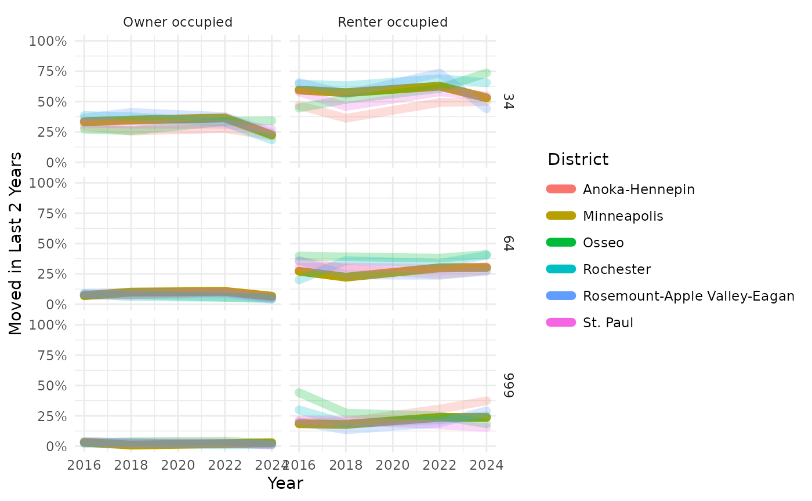
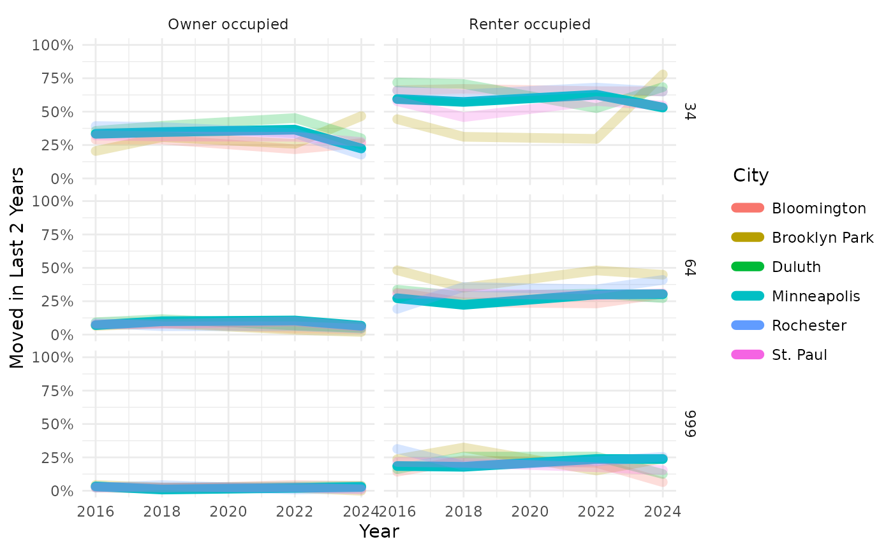
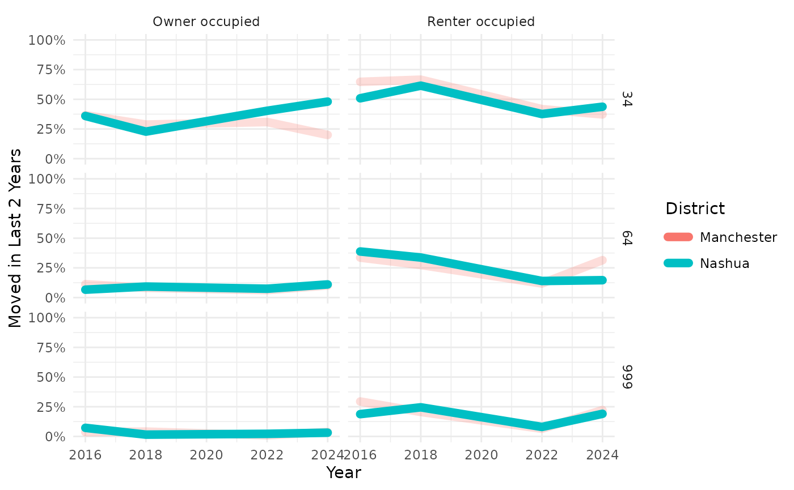
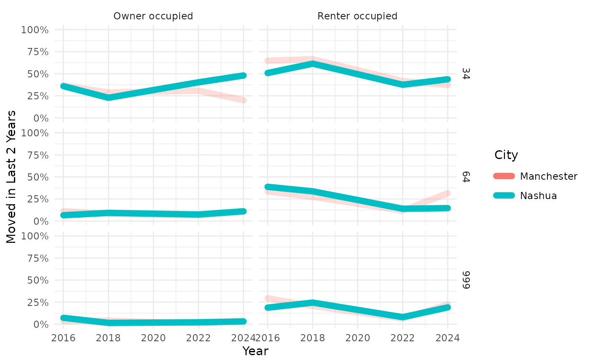
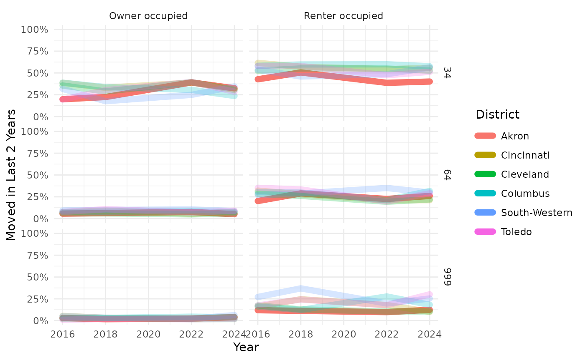
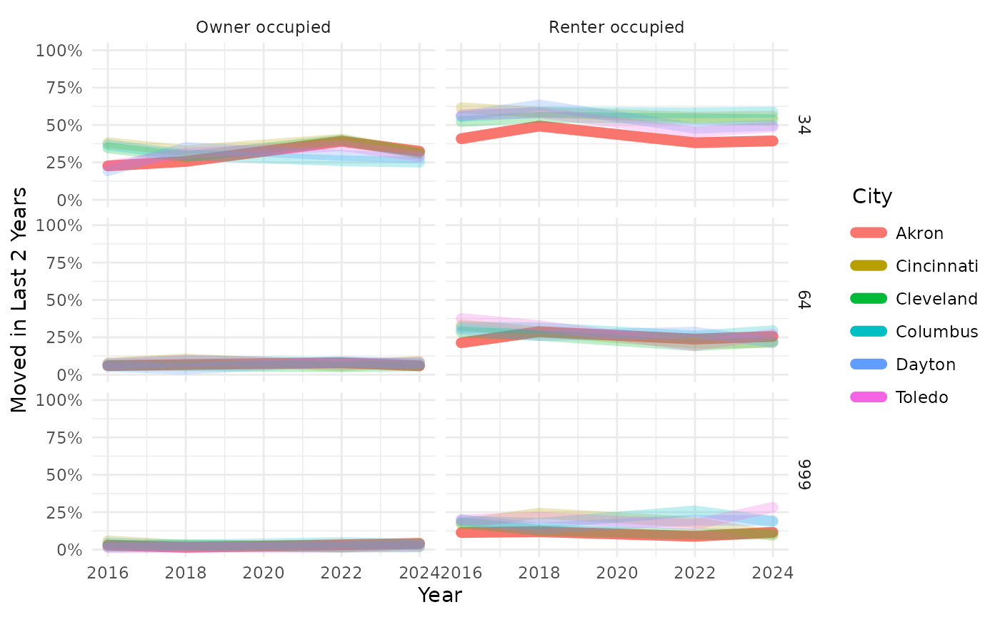
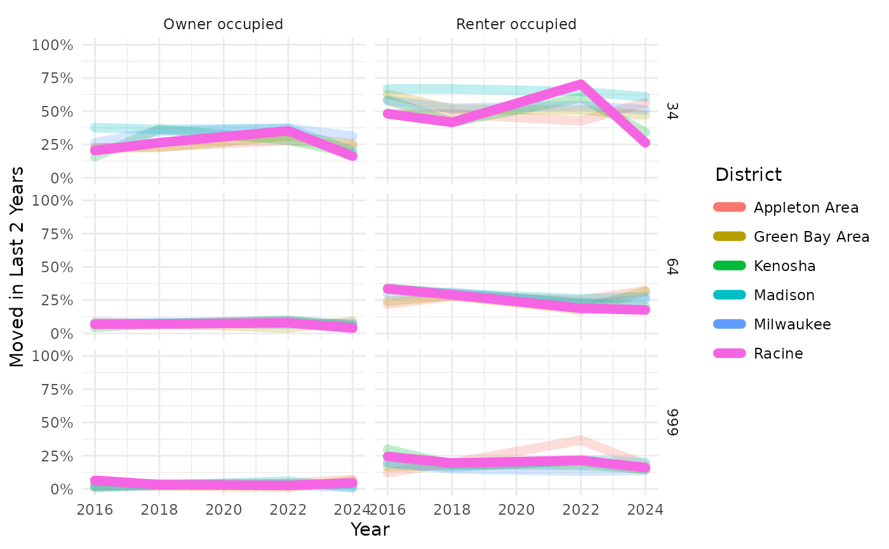
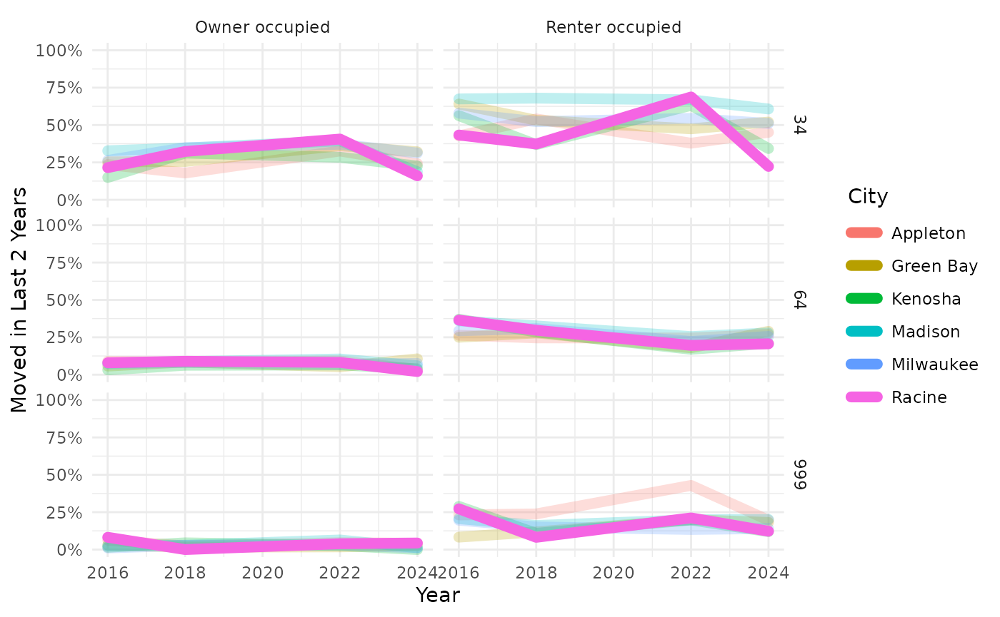

# Documenting Tenure, Age, and Years Living in Current Residence

Some of the many things that [The American Housing
Survey](https://www.census.gov/programs-surveys/ahs.html) reports about
are the age of the householder, whether they rent or own their
residence, and how many years they have lived there.

This example considers how those factors interact. It was motivated by
interest in how often families with children at Racine Unified School
District have to move between schools. Racine’s decision-makers are
particularly interested in understanding how renting might impact
student mobility.

## Setup

The data come from ACS table
[“B25128”](https://api.census.gov/data/2024/acs/acs5/groups/B25128.html).

| Group | Index | Variable | Tenure | Lower Age | Upper Age | Shortest Duration | Longest Duration |
|:---|---:|:---|:---|---:|---:|---:|---:|
| B25128 | 4 | B25128_004E | Owner occupied | 15 | 34 | 0 | 1 |
| B25128 | 5 | B25128_005E | Owner occupied | 15 | 34 | 2 | 4 |
| B25128 | 6 | B25128_006E | Owner occupied | 15 | 34 | 5 | 12 |
| B25128 | 7 | B25128_007E | Owner occupied | 15 | 34 | 13 | 22 |
| B25128 | 8 | B25128_008E | Owner occupied | 15 | 34 | 23 | 32 |
| B25128 | 9 | B25128_009E | Owner occupied | 15 | 34 | 33 | 232 |
| B25128 | 11 | B25128_011E | Owner occupied | 35 | 64 | 0 | 1 |
| B25128 | 12 | B25128_012E | Owner occupied | 35 | 64 | 2 | 4 |
| B25128 | 13 | B25128_013E | Owner occupied | 35 | 64 | 5 | 12 |
| B25128 | 14 | B25128_014E | Owner occupied | 35 | 64 | 13 | 22 |
| B25128 | 15 | B25128_015E | Owner occupied | 35 | 64 | 23 | 32 |
| B25128 | 16 | B25128_016E | Owner occupied | 35 | 64 | 33 | 232 |
| B25128 | 18 | B25128_018E | Owner occupied | 65 | 999 | 0 | 1 |
| B25128 | 19 | B25128_019E | Owner occupied | 65 | 999 | 2 | 4 |
| B25128 | 20 | B25128_020E | Owner occupied | 65 | 999 | 5 | 12 |
| B25128 | 21 | B25128_021E | Owner occupied | 65 | 999 | 13 | 22 |
| B25128 | 22 | B25128_022E | Owner occupied | 65 | 999 | 23 | 32 |
| B25128 | 23 | B25128_023E | Owner occupied | 65 | 999 | 33 | 232 |
| B25128 | 26 | B25128_026E | Renter occupied | 15 | 34 | 0 | 1 |
| B25128 | 27 | B25128_027E | Renter occupied | 15 | 34 | 2 | 4 |
| B25128 | 28 | B25128_028E | Renter occupied | 15 | 34 | 5 | 12 |
| B25128 | 29 | B25128_029E | Renter occupied | 15 | 34 | 13 | 22 |
| B25128 | 30 | B25128_030E | Renter occupied | 15 | 34 | 23 | 32 |
| B25128 | 31 | B25128_031E | Renter occupied | 15 | 34 | 33 | 232 |
| B25128 | 33 | B25128_033E | Renter occupied | 35 | 64 | 0 | 1 |
| B25128 | 34 | B25128_034E | Renter occupied | 35 | 64 | 2 | 4 |
| B25128 | 35 | B25128_035E | Renter occupied | 35 | 64 | 5 | 12 |
| B25128 | 36 | B25128_036E | Renter occupied | 35 | 64 | 13 | 22 |
| B25128 | 37 | B25128_037E | Renter occupied | 35 | 64 | 23 | 32 |
| B25128 | 38 | B25128_038E | Renter occupied | 35 | 64 | 33 | 232 |
| B25128 | 40 | B25128_040E | Renter occupied | 65 | 999 | 0 | 1 |
| B25128 | 41 | B25128_041E | Renter occupied | 65 | 999 | 2 | 4 |
| B25128 | 42 | B25128_042E | Renter occupied | 65 | 999 | 5 | 12 |
| B25128 | 43 | B25128_043E | Renter occupied | 65 | 999 | 13 | 22 |
| B25128 | 44 | B25128_044E | Renter occupied | 65 | 999 | 23 | 32 |
| B25128 | 45 | B25128_045E | Renter occupied | 65 | 999 | 33 | 232 |

Here are the settings needed for pulling data for four different states.
For each state, we will look at the 6 largest ones in the state,
focusing on one in particular from that subset.

| FIPS | State         | Focus       | Product | Geography                 | Label    |
|-----:|:--------------|:------------|:--------|:--------------------------|:---------|
|   27 | Minnesota     | Minneapolis | acs1    | school district (unified) | District |
|   27 | Minnesota     | Minneapolis | acs1    | place                     | City     |
|   33 | New Hampshire | Nashua      | acs1    | school district (unified) | District |
|   33 | New Hampshire | Nashua      | acs1    | place                     | City     |
|   39 | Ohio          | Akron       | acs1    | school district (unified) | District |
|   39 | Ohio          | Akron       | acs1    | place                     | City     |
|   55 | Wisconsin     | Racine      | acs1    | school district (unified) | District |
|   55 | Wisconsin     | Racine      | acs1    | place                     | City     |

If a household has moved in the last 2 years then it counts as a recent
move.

Note that the AHS takes place on odd-numbered years. That means that ACS
data based on the AHS from even-numbered years are not actually
comparable with data from odd-numbered years. Accordingly, this example
only pulls ACS data from even-numbered years. The current format of the
AHS began in 2015, so this example only pulls data from 2016 and later.

``` r

MOST_RECENT_ACS_YEAR <- hercacstables::most_recent_vintage("acs", "acs1")
ACS_YEARS <- seq(2016, MOST_RECENT_ACS_YEAR, 2)
```

## Fetch data

While the data always come from the same table, we will be querying the
API many times – twice for each combination of survey year, geography,
and state. We could make fewer API calls per year if we downloaded data
for EVERY state each time, rather than a separate call for each state. I
have not profiled whether it is faster to do more small data pulls or
fewer lange data pulls.

There are two functions for fetching data.

### Function to Fetch Housing Data

Here is the function for pulling counts of households by the age of the
householder, whether or not they rent, and how recently they moved in.

``` r

fetch_tenure_durations <- function(Product, Geography, FIPS) {
    .years <- ACS_YEARS
    if (Product == "acs1") {
        .years <- .years[.years != 2020]
    }
    .years |>
        purrr::map(
            \(.year) hercacstables::fetch_data(
                hercacstables::GLOSSARY_OF_TENURE_DURATIONS_BY_AGE$Variable, 
                year = .year,
                survey_type = "acs",
                table_or_survey_code = Product,
                for_geo = Geography,
                for_items = "*",
                state = FIPS
            )
        ) |>
        purrr::list_rbind()
}
```

### Function to Fetch Populations and Names

Here is the function for pulling the names and populations of geographic
units in a state. We will use these data to identify the largest units
in each state. Those are the units that we will use for comparison.

``` r

fetch_names_and_sizes <- function(Product, Geography, FIPS) {
    hercacstables::fetch_data(
        c("NAME", "B01001_001E"),
        year = MOST_RECENT_ACS_YEAR,
        for_geo = Geography,
        for_items = "*",
        survey_type = "acs",
        table_or_survey_code = Product,
        state = FIPS
    )
}
```

### Fetch the Data

This approach steps through each row of the SETTINGS table and fetches
the appropriate housing duration and population data.

``` r

RAW <- dplyr::mutate(
    SETTINGS,
    Durations = purrr::pmap(dplyr::pick("Product", "Geography", "FIPS"),
                            fetch_tenure_durations),
    Populations = purrr::pmap(dplyr::pick("Product", "Geography", "FIPS"),
                              fetch_names_and_sizes)
)
```

## Wrangle the Data

As always, there is a little aggregation to do with the data once we
have pulled what the ACS reports. There are some computations to do for
both types of data that we fetched.

### Define a Function to Wrangle Household Data

We will lump together the different durations of residency into two
categories: those who moved recently and those who have not.

``` r

wrangle_tenure_duration <- function(Durations, Geography) {
    Durations |>
        dplyr::inner_join(
            hercacstables::GLOSSARY_OF_TENURE_DURATIONS_BY_AGE,
            by = c("Group", "Index")
        ) |>
        dplyr::summarize(
            Households = sum(.data$Value, na.rm = TRUE),
            `Recent Movers` = sum(
                .data$Value * (.data$`Longest Duration` < DISPLACEMENT_WINDOW),
                na.rm = TRUE
            ),
            `Recent Move Rate` = .data$`Recent Movers` / .data$Households,
            .by = tidyselect::all_of(c(
                "Year",
                Geography,
                "Tenure",
                "Upper Age"
            ))
        )
}
```

### Define a Function to Find the Largest Geographic Units

The full lists of geographic units from each state also need
adjustments. First, we simplify the names by removing redundant features
like the state’s name and words like “school district.” Next, we
identify which row corresponds to the focal geographic unit. Finally, we
pare down the number of columns to a useful minimum.

``` r

wrangle_names_and_sizes <- function(Populations, Geography, Focus, Label) {
    Populations |>
        dplyr::mutate(
            "{Label}" := .data$NAME |>
                stringr::str_extract(
                    "[^,]+"
                ) |>
                stringr::str_remove_all(
                    stringr::regex("city|metropolitan|municipal|district|public|schools?",
                                   ignore_case = TRUE)
                ) |>
                stringr::str_squish(),
            Focal = stringr::str_detect(.data[[Label]], Focus)
        ) |>
        dplyr::select(
            tidyselect::all_of(c(
                Label,
                Geography,
                "Focal",
                Population = "Value"
            ))
        ) |>
        dplyr::slice_max(
            .data$Population,
            n = NUMBER_OF_BIG_UNITS
        )
}
```

### Apply the Wrangling Functions

Once again, we apply the wrangling functions to each row of the raw
data. Once the duration and population data are wrangled, we join them
into the final data sets that we actually want to use.

``` r

WRANGLED <- dplyr::mutate(
    RAW,
    TenureDuration = purrr::pmap(
        dplyr::pick("Durations", "Geography"),
        wrangle_tenure_duration
    ),
    LargePlaces = purrr::pmap(
        dplyr::pick("Populations", "Geography", "Focus", "Label"),
        wrangle_names_and_sizes
    ),
    BigTenure = purrr::pmap(
        dplyr::pick("TenureDuration", "LargePlaces", "Geography"),
        \(TenureDuration, LargePlaces, Geography) {
            TenureDuration |>
                dplyr::inner_join(
                    LargePlaces,
                    by = Geography
                ) |>
                dplyr::arrange(
                    dplyr::across(tidyselect::all_of(Geography))
                )
        }
    )
)
```

## Summarize the Findings

Finally, we make some pretty tables and plots to display the results of
all of that wrangling.

### Define the Tabulation Function

This function makes a table where each cell shows both the percent
recently moved and the number of households in each combination of place
and year.

``` r

tabulate_tenure_durations <- function(BigTenure, Label) {

    nyears <- length(unique(BigTenure$Year))
    
    BigTenure |>
        dplyr::summarize(
            `Recent Move Rate` = weighted.mean(
                .data$`Recent Move Rate`,
                .data$Households
            ),
            Households = sum(.data$Households),
            .by = tidyselect::all_of(c("Year", Label, "Tenure"))
        ) |>
        dplyr::mutate(
            dplyr::across("Recent Move Rate",
                          scales::label_percent(accuracy = 1)),
            dplyr::across("Households",
                          scales::label_comma(accuracy = 1)),
            Text = sprintf("%s of %s",
                           .data$`Recent Move Rate`,
                           .data$Households)
        ) |>
        dplyr::select(
            tidyselect::all_of(c("Year", Label, "Tenure", "Text"))
        ) |>
        tidyr::pivot_wider(
            names_from = "Year",
            names_sort = TRUE,
            values_from = "Text",
            values_fill = ""
        ) |>
        dplyr::arrange(
            dplyr::across(tidyselect::all_of(c(Label, "Tenure")))
        ) |>
        knitr::kable(
            caption = "Households that Have Recently Moved",
            align = paste0(c("l", rep("r", nyears)),
                           collapse = "")
        )
}
```

### Define the Plotting Function

This function makes line plots that show change in percentage recently
moved over time, with line colors by geographic unit and panels for each
combination of householder age and tenure.

``` r

plot_tenure_duration <- function(BigTenure, Label) {
    BigTenure |>
        ggplot2::ggplot(
            ggplot2::aes(x = .data$Year,
                         y = .data$`Recent Move Rate`,
                         color = .data[[Label]],
                         group = .data[[Label]],
                         alpha = .data$Focal)
        ) +
        ggplot2::geom_line(
            linewidth = 8.0 / 3.0,
            lineend = "round",
            linejoin = "round",
            na.rm = TRUE
        ) +
        ggplot2::scale_x_continuous(
            breaks = scales::breaks_width(2),
            minor_breaks = scales::breaks_width(1L),
            labels = scales::label_number(accuracy = 1,
                                          big.mark = "")
        ) +
        ggplot2::scale_y_continuous(
            name = paste("Moved in Last",
                         DISPLACEMENT_WINDOW,
                         "Years"),
            limits = c(0, 1),
            labels = scales::label_percent(accuracy = 1)
        ) +
        ggplot2::scale_alpha_manual(
            values = c(
                `TRUE` = 1,
                `FALSE` = 0.25
            ),
            guide = ggplot2::guide_none()
        ) +
        ggplot2::facet_grid(
            rows = ggplot2::vars(.data$`Upper Age`),
            cols = ggplot2::vars(.data$Tenure)
        ) +
        ggplot2::theme_minimal()
}
```

### Apply the Summary Functions

Another demonstration of how succinct code can be when using the
functional programming paradigm.

``` r

SUMMARIZED <- dplyr::mutate(
    WRANGLED,
    Table = purrr::pmap(dplyr::pick("BigTenure", "Label"),
                        tabulate_tenure_durations),
    Plot = purrr::pmap(dplyr::pick("BigTenure", "Label"),
                       plot_tenure_duration)
)
```

## Results

Here’s what all of that prep creates:

``` r

SUMMARIZED |>
    tidyr::nest(
        .by = c("FIPS", "State", "Focus"),
        .key = "Results"
    ) |>
    purrr::pwalk(
        \(FIPS, State, Focus, Results) {
            cat(paste0("## ", Focus, ", ", State, "\n\n"))
            Results |>
                dplyr::select(
                    "Label", "Table", "Plot"
                ) |>
                purrr::pwalk(
                    \(Label, Table, Plot) {
                        cat("###", Label, "\n\n")
                        print(Table)
                        cat("\n\n")
                        print(Plot)
                        cat("\n\n")
                    }
                )
        }
    )
```

## Minneapolis, Minnesota

### District

| District | Tenure | 2016 | 2018 | 2022 | 2024 |
|:---|---:|---:|---:|---:|:---|
| Anoka-Hennepin | Owner occupied | 10% of 69,363 | 9% of 70,857 | 10% of 76,541 | 7% of 76,830 |
| Anoka-Hennepin | Renter occupied | 36% of 17,190 | 30% of 16,606 | 34% of 15,629 | 36% of 17,225 |
| Minneapolis | Owner occupied | 10% of 80,243 | 13% of 83,540 | 13% of 92,192 | 8% of 90,363 |
| Minneapolis | Renter occupied | 42% of 91,663 | 39% of 91,580 | 47% of 101,502 | 41% of 104,117 |
| Osseo | Owner occupied | 9% of 39,795 | 9% of 44,118 | 9% of 41,661 | 8% of 43,183 |
| Osseo | Renter occupied | 42% of 13,561 | 42% of 12,007 | 40% of 15,579 | 46% of 14,910 |
| Rochester | Owner occupied | 12% of 37,135 | 10% of 35,818 | 9% of 38,641 | 5% of 38,788 |
| Rochester | Renter occupied | 42% of 14,569 | 44% of 18,011 | 48% of 19,266 | 50% of 18,616 |
| Rosemount-Apple Valley-Eagan | Owner occupied | 11% of 45,075 | 11% of 45,476 | 10% of 45,995 | 5% of 49,801 |
| Rosemount-Apple Valley-Eagan | Renter occupied | 45% of 11,908 | 35% of 11,728 | 45% of 16,418 | 33% of 13,988 |
| St. Paul | Owner occupied | 10% of 56,236 | 10% of 57,137 | 11% of 68,098 | 8% of 63,986 |
| St. Paul | Renter occupied | 41% of 56,567 | 36% of 58,721 | 41% of 58,556 | 38% of 64,586 |

Households that Have Recently Moved {.table style="width:100%;"}



### City

| City | Tenure | 2016 | 2018 | 2022 | 2024 |
|:---|---:|---:|---:|---:|:---|
| Bloomington | Owner occupied | 8% of 23,876 | 8% of 23,470 | 6% of 26,263 | 6% of 24,842 |
| Bloomington | Renter occupied | 39% of 12,990 | 36% of 12,541 | 39% of 12,941 | 35% of 14,044 |
| Brooklyn Park | Owner occupied | 8% of 19,175 | 10% of 19,258 | 6% of 22,243 | 7% of 21,290 |
| Brooklyn Park | Renter occupied | 45% of 8,536 | 33% of 8,572 | 35% of 8,566 | 51% of 8,368 |
| Duluth | Owner occupied | 11% of 21,225 | 12% of 22,075 | 11% of 22,650 | 8% of 22,584 |
| Duluth | Renter occupied | 48% of 13,912 | 47% of 14,123 | 40% of 15,954 | 48% of 16,792 |
| Minneapolis | Owner occupied | 10% of 80,243 | 13% of 83,653 | 13% of 92,192 | 8% of 90,363 |
| Minneapolis | Renter occupied | 42% of 91,663 | 39% of 91,580 | 47% of 101,502 | 41% of 104,117 |
| Rochester | Owner occupied | 13% of 32,325 | 11% of 31,471 | 10% of 33,837 | 5% of 33,955 |
| Rochester | Renter occupied | 42% of 14,153 | 44% of 17,890 | 47% of 18,943 | 50% of 17,927 |
| St. Paul | Owner occupied | 10% of 56,236 | 10% of 57,137 | 11% of 68,098 | 8% of 63,986 |
| St. Paul | Renter occupied | 41% of 56,567 | 36% of 58,721 | 41% of 58,556 | 38% of 64,586 |

Households that Have Recently Moved {.table style="width:100%;"}



## Nashua, New Hampshire

### District

| District | Tenure | 2016 | 2018 | 2022 | 2024 |
|:---|---:|---:|---:|---:|:---|
| Manchester | Owner occupied | 12% of 19,201 | 10% of 19,162 | 8% of 24,906 | 9% of 22,836 |
| Manchester | Renter occupied | 44% of 26,940 | 42% of 25,124 | 21% of 23,162 | 32% of 25,327 |
| Nashua | Owner occupied | 9% of 18,383 | 8% of 21,468 | 9% of 20,791 | 11% of 21,820 |
| Nashua | Renter occupied | 37% of 17,280 | 39% of 17,052 | 18% of 17,226 | 25% of 19,219 |

Households that Have Recently Moved {.table}



### City

| City | Tenure | 2016 | 2018 | 2022 | 2024 |
|:---|---:|---:|---:|---:|:---|
| Manchester | Owner occupied | 12% of 19,201 | 10% of 19,162 | 8% of 24,906 | 9% of 22,836 |
| Manchester | Renter occupied | 44% of 26,940 | 42% of 25,124 | 21% of 23,162 | 32% of 25,327 |
| Nashua | Owner occupied | 9% of 18,383 | 8% of 21,468 | 9% of 20,791 | 11% of 21,820 |
| Nashua | Renter occupied | 37% of 17,280 | 39% of 17,052 | 18% of 17,226 | 25% of 19,219 |

Households that Have Recently Moved {.table}



## Akron, Ohio

### District

| District | Tenure | 2016 | 2018 | 2022 | 2024 |
|:---|---:|---:|---:|---:|:---|
| Akron | Owner occupied | 6% of 39,021 | 7% of 39,693 | 11% of 41,007 | 8% of 43,899 |
| Akron | Renter occupied | 27% of 40,062 | 34% of 40,952 | 26% of 38,393 | 29% of 38,205 |
| Cincinnati | Owner occupied | 11% of 60,544 | 11% of 61,582 | 10% of 67,418 | 11% of 69,763 |
| Cincinnati | Renter occupied | 43% of 90,420 | 41% of 91,871 | 36% of 90,984 | 36% of 92,377 |
| Cleveland | Owner occupied | 7% of 71,531 | 7% of 69,890 | 8% of 68,962 | 7% of 79,024 |
| Cleveland | Renter occupied | 36% of 97,840 | 34% of 104,038 | 31% of 100,452 | 31% of 92,722 |
| Columbus | Owner occupied | 10% of 90,023 | 10% of 96,807 | 11% of 100,752 | 9% of 111,950 |
| Columbus | Renter occupied | 42% of 138,650 | 42% of 140,155 | 40% of 149,607 | 42% of 146,373 |
| South-Western | Owner occupied | 12% of 31,087 | 9% of 33,895 | 11% of 32,700 | 11% of 34,485 |
| South-Western | Renter occupied | 36% of 22,979 | 36% of 21,258 | 37% of 22,119 | 39% of 23,925 |
| Toledo | Owner occupied | 7% of 44,164 | 11% of 45,449 | 10% of 54,738 | 9% of 50,069 |
| Toledo | Renter occupied | 43% of 48,595 | 43% of 47,517 | 30% of 43,233 | 37% of 44,224 |

Households that Have Recently Moved {.table style="width:100%;"}



### City

| City | Tenure | 2016 | 2018 | 2022 | 2024 |
|:---|---:|---:|---:|---:|:---|
| Akron | Owner occupied | 6% of 41,271 | 7% of 42,719 | 11% of 43,716 | 9% of 46,831 |
| Akron | Renter occupied | 27% of 41,800 | 34% of 43,254 | 27% of 41,679 | 28% of 39,984 |
| Cincinnati | Owner occupied | 11% of 51,482 | 11% of 52,732 | 11% of 58,387 | 11% of 58,544 |
| Cincinnati | Renter occupied | 44% of 84,083 | 42% of 86,035 | 36% of 87,362 | 36% of 87,420 |
| Cleveland | Owner occupied | 7% of 70,414 | 7% of 69,133 | 8% of 68,158 | 7% of 79,062 |
| Cleveland | Renter occupied | 36% of 97,892 | 35% of 103,892 | 31% of 101,269 | 31% of 92,388 |
| Columbus | Owner occupied | 11% of 153,511 | 11% of 164,967 | 10% of 170,155 | 9% of 181,936 |
| Columbus | Renter occupied | 41% of 195,602 | 42% of 201,067 | 40% of 221,886 | 41% of 214,714 |
| Dayton | Owner occupied | 6% of 27,519 | 7% of 26,733 | 9% of 32,464 | 9% of 31,193 |
| Dayton | Renter occupied | 39% of 31,203 | 38% of 33,363 | 33% of 30,844 | 33% of 28,585 |
| Toledo | Owner occupied | 7% of 56,880 | 10% of 58,391 | 9% of 68,044 | 9% of 63,028 |
| Toledo | Renter occupied | 43% of 61,242 | 42% of 58,458 | 29% of 53,217 | 35% of 55,671 |

Households that Have Recently Moved {.table}



## Racine, Wisconsin

### District

| District | Tenure | 2016 | 2018 | 2022 | 2024 |
|:---|---:|---:|---:|---:|:---|
| Appleton Area | Owner occupied | 10% of 25,206 | 8% of 26,409 | 11% of 28,046 | 9% of 27,046 |
| Appleton Area | Renter occupied | 31% of 14,474 | 35% of 14,496 | 34% of 15,800 | 38% of 15,785 |
| Green Bay Area | Owner occupied | 8% of 34,758 | 8% of 35,150 | 7% of 35,029 | 10% of 36,929 |
| Green Bay Area | Renter occupied | 37% of 22,583 | 34% of 19,616 | 30% of 23,797 | 34% of 18,575 |
| Kenosha | Owner occupied | 5% of 27,968 | 10% of 30,183 | 10% of 33,549 | 6% of 33,860 |
| Kenosha | Renter occupied | 43% of 20,712 | 32% of 18,202 | 34% of 20,208 | 25% of 20,179 |
| Madison | Owner occupied | 10% of 49,773 | 10% of 50,034 | 12% of 61,873 | 7% of 59,619 |
| Madison | Renter occupied | 53% of 57,361 | 51% of 60,113 | 51% of 72,255 | 47% of 74,478 |
| Milwaukee | Owner occupied | 8% of 93,184 | 10% of 96,609 | 10% of 95,982 | 9% of 102,128 |
| Milwaukee | Renter occupied | 40% of 135,099 | 38% of 134,432 | 34% of 137,872 | 34% of 133,112 |
| Racine | Owner occupied | 8% of 33,763 | 7% of 33,293 | 10% of 39,291 | 6% of 41,249 |
| Racine | Renter occupied | 37% of 21,388 | 32% of 21,746 | 33% of 16,789 | 20% of 18,591 |

Households that Have Recently Moved {.table style="width:100%;"}



### City

| City | Tenure | 2016 | 2018 | 2022 | 2024 |
|:---|---:|---:|---:|---:|:---|
| Appleton | Owner occupied | 11% of 18,632 | 8% of 19,717 | 11% of 21,624 | 7% of 20,110 |
| Appleton | Renter occupied | 33% of 10,220 | 35% of 10,147 | 33% of 11,480 | 32% of 9,514 |
| Green Bay | Owner occupied | 8% of 23,996 | 9% of 24,373 | 8% of 24,710 | 11% of 25,736 |
| Green Bay | Renter occupied | 38% of 19,289 | 34% of 16,899 | 29% of 20,979 | 36% of 15,473 |
| Kenosha | Owner occupied | 4% of 20,032 | 9% of 21,185 | 9% of 24,832 | 5% of 23,937 |
| Kenosha | Renter occupied | 44% of 18,499 | 29% of 15,950 | 31% of 16,268 | 25% of 17,345 |
| Madison | Owner occupied | 10% of 52,869 | 11% of 51,248 | 13% of 59,349 | 6% of 58,600 |
| Madison | Renter occupied | 54% of 56,680 | 52% of 60,415 | 51% of 70,219 | 47% of 74,964 |
| Milwaukee | Owner occupied | 8% of 93,184 | 10% of 96,609 | 10% of 95,982 | 9% of 102,128 |
| Milwaukee | Renter occupied | 40% of 135,099 | 38% of 134,432 | 34% of 137,872 | 34% of 133,112 |
| Racine | Owner occupied | 9% of 14,864 | 8% of 14,999 | 12% of 19,872 | 5% of 20,080 |
| Racine | Renter occupied | 38% of 15,735 | 30% of 15,159 | 34% of 11,391 | 19% of 13,069 |

Households that Have Recently Moved {.table style="width:100%;"}


