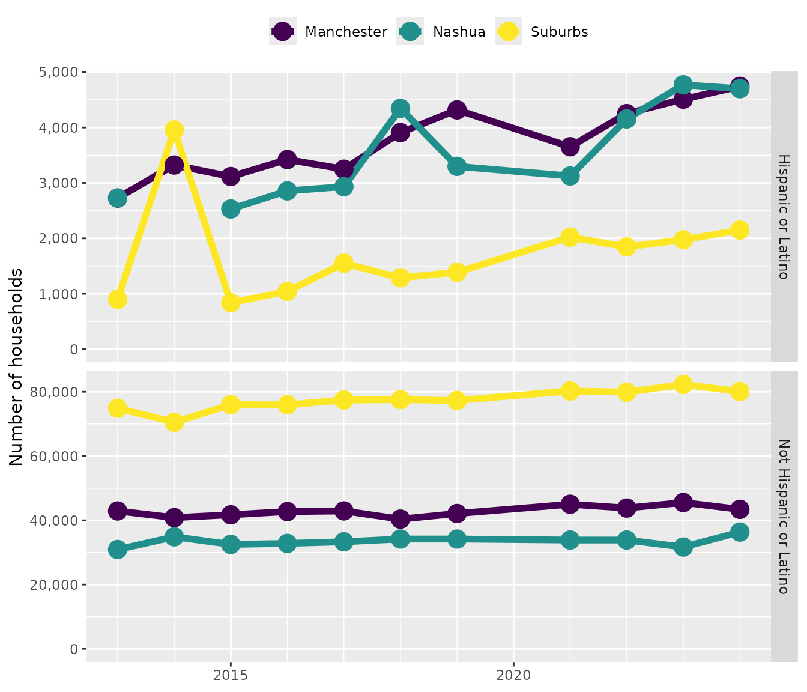

# hercacstables

## Welcome

### For the newest R users:

If you are new to R, but not data science, then I suggest checking out
[R for Data Science](https://r4ds.hadley.nz/intro.html). If have a
background that is not data science, then I have heard good things about
[this book](https://datascienceineducation.com/).

### First-time users of `hercacstables`

If this is your first time using this package then you probably want to
register with the Census. Registering is important because it helps you
make more queries to the API. The Census limits the number of anonymous
API queries that it receives from any one IP address. The
[`vignette("set_up_your_api_key")`](https://higherx4racine.github.io/hercacstables/articles/set_up_your_api_key.md)
will guide you through the process.

### Otherwise, welcome back!

This package helps R users to access data from the United States Census
Bureau, especially its American Community Survey.

The American Community Survey (ACS) from the US Census’s website
provides a vast amount of useful data.

However, it returns those data in a weirdly idiosyncratic way. Even
though the output seems tabular, the data are really organized in a
tree-like fashion. This package is intended to make it easy to access
and use the ACS data with R.

The database has an enormous amount of information, stored in a
versatile but cumbersome format. Data are stored in hundreds of
different tables, called “groups,” that give breakdowns of information.
For example, group
[`B21005`](https://api.census.gov/data/2022/acs/acs5/groups/B21005.html)
reports counts of people according to their employment status, military
service, and age. Each row in a group reports a value for a specific
slice of the topic. For example, row 5 in group `B21005` gives the
number of employed veterans between the ages of 18 and 34. The Census
combines the group code and row into a variable, `B21005_005E`. This
packing of information gives the Census a very flexible way to report
all of their data. However, it is challenging for the user because you
have to somehow know the variables that report the data that you are
interested in.

In light of that, `hercacstables` is designed to help people make
repeated, efficient use of the Census’s API. There are *glossary* tables
that explicitly connect real-world concepts to Census variables. You can
then use database-style joins to connect the concepts to the values that
you pull from the API.

Many questions that work with Census data follow a common pattern:

> How did \[measurement\] differ among \[demographic groups\] and across
> \[geographic levels\] in \[geographic area\] during \[span of time\]?

A **Measurement** is any of the huge number of things that the Census
keeps track of. Measurements are arranged in tables (called “groups”)
and rows. If you were drawing maps, this would be what determines the
color of each area. Examples include population size (table B01001 and
others), median household income (table B19013 and others), types of
computers in a household (table B28001), number of vehicles used while
commuting (table B08015).

A **Demographic Group** is a subset of the population that shares
specific traits. Demographic groups can be represented either by groups
(common when reporting by race or ethnicity) or rows (most other cases,
like age, sex, or veteran status). If you were drawing maps, you would
probably have a different version of each map for each demographic
grouping. Examples include the number of Hispanic girls under 5 years
old (table B01001I, row 18), the median income of Asian American
households (table B19013D, row 1), the number of households with no
computer (table B28001, row 11), the number of vehicles used by women
while commuting (table B08015, row 3).

A **Geographic Level** is a [Census-defined
hierarchy](https://www.census.gov/programs-surveys/geography/guidance.html)
from the whole country to small blocks. The level that you are
interested in is determined by the scale of your question. If you were
drawing maps, these would be the areas that appeared as different
colors. Examples include congressional districts, incorporated cities,
school districts, and Census tracts.

A **Geographic Area** is a set of specific instances of one or more
geographic levels. This is the full geographic scope of your question.
If you were drawing maps, this would determine their scale. Examples
include whole states, metropolitan areas, Census-designated places, and
counties.

## The workflow

1.  Identify the groups and rows that contain the data you need
    - Find potential groups by searching the `Universe` and
      `Description` fields of
      [`hercacstables::METADATA_FOR_ACS_GROUPS`](https://higherx4racine.github.io/hercacstables/reference/METADATA_FOR_ACS_GROUPS.md).
    - Identify specific variables with
      [`hercacstables::METADATA_FOR_ACS_VARIABLES`](https://higherx4racine.github.io/hercacstables/reference/METADATA_FOR_ACS_VARIABLES.md):
      filter by the `Group` field and examine the `Details` field.
    - Create a glossary that maps from the Census variable name to your
      variables.
      - You may need several if you are pulling data from several
        groups.
2.  Define the geographies that you will use
    - Use
      [`hercacstables::METADATA_FOR_ACS_GEOGRAPHIES`](https://higherx4racine.github.io/hercacstables/reference/METADATA_FOR_ACS_GEOGRAPHIES.md)
      for this.
    - You need to know at least two levels of geography:
      - The one that you want to pull data for, your level of interest
        - This is often small, like tract or county subdivision.
      - Any and all levels that contain your level of interest
        - These will be larger, like state or county.
    - Create a glossary that maps from geographic ids to meaningful
      names.
3.  Write fetching functions that call
    [`hercacstables::fetch_data()`](https://higherx4racine.github.io/hercacstables/reference/fetch_data.md)
    - they will often always use the same variables (from step 1)
    - they may need to be parameterized by geography if you’re pulling
      from multiple levels
    - they should always be parameterized by year so that you can use
      them to look at trends and/or reuse them in subsequent years.
4.  Write wrangling functions that for turning fetched tables into
    useful ones.
    - These will probably involve using
      [`dplyr::inner_join()`](https://dplyr.tidyverse.org/reference/mutate-joins.html)
      between the fetched data and your glossaries.
    - You can also perform calculations like aggregating or finding
      remainders.
    - You will probably only have to write these functions once per
      question.
5.  Run the workflow in two stages.
    - Use
      [`purrr::map()`](https://purrr.tidyverse.org/reference/map.html)
      and
      [`purrr::list_rbind()`](https://purrr.tidyverse.org/reference/list_c.html)
      to download all of the data into one data frame.
      - Cache that result because API calls are slow
    - Run the wrangling functions.
      - Save these results with,
        e.g. [`base::saveRDS()`](https://rdrr.io/r/base/readRDS.html).

## Example

Let’s say you want to ask this question:

> How did \[the number of households\] differ between \[Hispanic and
> non-Hispanic people\] and across \[Manchester, Nashua, and suburban
> areas\] in \[Hillsborough County, NH\] during \[the last 10 years\]?

### Find the **measurement** and **demographic groups**

First, find the variables that describe the numbers of households. One
way to do this is to search
[`hercacstables::METADATA_FOR_ACS_GROUPS`](https://higherx4racine.github.io/hercacstables/reference/METADATA_FOR_ACS_GROUPS.md)
for groups whose `Universe` is “Households” and whose `Description`
contains “Hispanic” or “Ethnicity.” A group’s `Universe` describes what
it is measuring, often telling you the units of whatever its values are.
A group’s `Description` is a phrase that summarizes what it reports.

``` r
hercacstables::METADATA_FOR_ACS_GROUPS |>
    dplyr::filter(
        .data$ACS5,
        stringr::str_detect(.data$Universe, "Household"),
        stringr::str_detect(.data$Description, "Hispanic|Ethnic")
    ) |>
    dplyr::select(
        "Group",
        "Universe",
        "Description"
    ) |>
    knitr::kable()
```

| Group   | Universe                                                                 | Description                                                                                                    |
|:--------|:-------------------------------------------------------------------------|:---------------------------------------------------------------------------------------------------------------|
| B11001H | Households with a householder who is White alone, not Hispanic or Latino | Household Type (Including Living Alone) (White Alone, Not Hispanic or Latino)                                  |
| B11001I | Households with a householder who is Hispanic or Latino                  | Household Type (Including Living Alone) (Hispanic or Latino)                                                   |
| B19001H | Households with a householder who is White alone, not Hispanic or Latino | Household Income in the Past 12 Months (White Alone, Not Hispanic or Latino Householder)                       |
| B19001I | Households with a householder who is Hispanic or Latino                  | Household Income in the Past 12 Months (Hispanic or Latino Householder)                                        |
| B19013H | Households with a householder who is White alone, not Hispanic or Latino | Median Household Income in the Past 12 Months (White Alone, Not Hispanic or Latino Householder)                |
| B19013I | Households with a householder who is Hispanic or Latino                  | Median Household Income in the Past 12 Months (Hispanic or Latino Householder)                                 |
| B19025H | Households with a householder who is White alone, not Hispanic or Latino | Aggregate Household Income in the Past 12 Months (White Alone, Not Hispanic or Latino Householder)             |
| B19025I | Households with a householder who is Hispanic or Latino                  | Aggregate Household Income in the Past 12 Months (Hispanic or Latino Householder)                              |
| B19037H | Households with a householder who is White alone, not Hispanic or Latino | Age of Householder by Household Income in the Past 12 Months (White Alone, Not Hispanic or Latino Householder) |
| B19037I | Households with a householder who is Hispanic or Latino                  | Age of Householder by Household Income in the Past 12 Months (Hispanic or Latino Householder)                  |
| B22005H | Households with a householder who is White alone, not Hispanic or Latino | Receipt of Food Stamps/SNAP in the Past 12 Months by Race of Householder (White Alone, Not Hispanic or Latino) |
| B22005I | Households with a householder who is Hispanic or Latino                  | Receipt of Food Stamps/SNAP in the Past 12 Months by Race of Householder (Hispanic or Latino)                  |

It looks like our best bet is group “B11001I.” It is likely that group
“B11001” contains counts of households of any race. The first row of
most groups is the total value across any demographic subset that it
keeps track of. Since our question does not ask about different
household types, we probably just need row one from groups “B11001” and
“B11001I.” This gives us a good opportunity to document the ethnicities
counted in each.

``` r
HOUSEHOLD_GROUPS <- c("B11001", "B11001I")
household_variables <- hercacstables::METADATA_FOR_ACS_VARIABLES |>
    dplyr::filter(
        .data$Dataset == "ACS1",
        .data$Group %in% HOUSEHOLD_GROUPS,
                  .data$Index == 1) |>
    dplyr::mutate(
        Ethnicity = dplyr::case_match(.data$Group,
                                      "B11001" ~ "All",
                                      "B11001I" ~ "Hispanic or Latino")
    ) |>
    dplyr::select("Group", "Index", "Variable", "Ethnicity")

knitr::kable(household_variables,
             align = c("lrll"))
```

| Group   | Index | Variable     | Ethnicity          |
|:--------|------:|:-------------|:-------------------|
| B11001I |     1 | B11001I_001E | Hispanic or Latino |
| B11001  |     1 | B11001_001E  | All                |

### Find the **geographic levels** and **geographic area**

The next step is to [find the
codes](https://www.census.gov/library/reference/code-lists/ansi.html)
that are related to the geographic areas and levels. We need to know the
FIPS code for the state, county, and two cities. We also need to know
that the geographic level that we’re working with is “county
subdivision.” As the last part of this step, we define a glossary to
translate from the FIPS codes for the different geographies to a
human-readable name.

``` r
NEW_HAMPSHIRE <- "33"
COUNTY_LEVEL <- "county"
HILLSBOROUGH_CO <- "011"
CITY_LEVEL <- "county subdivision"
MANCHESTER_NH <- "45140"
NASHUA_NH <- "50260"

geography_definitions <- tibble::tribble(
    ~ FIPS,          ~ Location,
    HILLSBOROUGH_CO, "County-wide",
    MANCHESTER_NH,   "Manchester",
    NASHUA_NH,       "Nashua"
)

geography_definitions |>
    knitr::kable()
```

| FIPS  | Location    |
|:------|:------------|
| 011   | County-wide |
| 45140 | Manchester  |
| 50260 | Nashua      |

### Find the **time interval**

This example looks for population changes “in the last ten years.” What
that really means is the ten most recent years for which we have data.
We can use 1-year estimates for our question because we are dealing with
geographic levels that have more than 50,000 people in them. In the case
of the 1-year ACS dataset, the latest will be one or two years ago. The
earliest will be 11 years before that because there was no survey in
2020.

``` r
BUILD_DATE <- Sys.Date()
LATEST_YEAR <- hercacstables::most_recent_vintage("acs", "acs1")
TEN_YEARS_AGO <- LATEST_YEAR - 11L
```

The last ten years available from the Census are, as of 2026-01-29, 2013
through 2024.

``` r
YEARS_INCLUDED <- c(TEN_YEARS_AGO:2019, 2021:LATEST_YEAR)
```

### Define functions that use the API

We will need to make multiple calls to the API, so it makes sense to
create some reusable functions. We need two calls per year. The first
one will pull the county-wide household counts. The second one will pull
the household counts for each city. Each function should have “year” as
its argument so that we can reuse it.

``` r
generalized_fetch_data <- function(.year, .level, .areas, ...) {
    hercacstables::fetch_data(
        variables = household_variables$Variable,
        year = .year,
        survey_type = "acs",
        table_or_survey_code = "acs1",
        for_geo = .level,
        for_items = .areas,
        state = NEW_HAMPSHIRE,
        ...
    )
}

fetch_county_households <- function(.year){
    generalized_fetch_data(.year,
                           "county",
                           HILLSBOROUGH_CO)
}

fetch_city_households <- function(.year){
    generalized_fetch_data(.year,
                           CITY_LEVEL,
                           c(MANCHESTER_NH,
                             NASHUA_NH),
                           county = HILLSBOROUGH_CO)
}

fetch_example_data <- function(.year) {
    dplyr::bind_rows(
        fetch_county_households(.year),
        fetch_city_households(.year)
    )
}
```

### Fetch the data

This is where `hercacstables` starts to come into its own. We define the
fetching process as few times as possible, just tweaking it for related
cases. This leads to a lot of code reuse and efficiency, especially for
reports that you just need to update once a year.

``` r
raw_households <- YEARS_INCLUDED |>
    purrr::map(fetch_example_data) |>
    purrr::list_rbind()
```

``` r
raw_households |>
    dplyr::filter(.data$Year == LATEST_YEAR) |>
    dplyr::mutate(
        dplyr::across(c("Value"),
                      scales::label_comma(accuracy = 1))
    ) |>
    knitr::kable(
        align = "lllrrrl"
    )
```

| state | county | Group   | Index | Measure |   Value | Year | county subdivision |
|:------|:-------|:--------|------:|--------:|--------:|:-----|:-------------------|
| 33    | 011    | B11001I |     1 |       E |  11,591 | 2024 | NA                 |
| 33    | 011    | B11001  |     1 |       E | 171,415 | 2024 | NA                 |
| 33    | 011    | B11001I |     1 |       E |   4,742 | 2024 | 45140              |
| 33    | 011    | B11001  |     1 |       E |  48,163 | 2024 | 45140              |
| 33    | 011    | B11001I |     1 |       E |   4,700 | 2024 | 50260              |
| 33    | 011    | B11001  |     1 |       E |  41,039 | 2024 | 50260              |

### Wrangle the data

The raw data are not very usable. Several of the columns still have
codes, rather than human-readable values. The value column also does not
explicitly state values for the suburban or for non-Hispanic folks. The
“wrangling” process is where we addressing these drawbacks.

#### Map codes to words

We should get rid of the columns that are Census database codes and
create columns about location and demographics that have human-readable
values.

``` r
households <- raw_households |>
    dplyr::inner_join(
        household_variables,
        by = c("Group", "Index")
    ) |>
    dplyr::mutate(
        FIPS = dplyr::coalesce(.data$`county subdivision`,
                               .data$county)
    ) |>
    dplyr::inner_join(
        geography_definitions,
        by = "FIPS"
    ) |>
    dplyr::select(
        "Location",
        "Year",
        "Ethnicity",
        Households = "Value"
    )

households |>
    dplyr::filter(.data$Year == LATEST_YEAR) |>
    dplyr::mutate(
        dplyr::across(c("Households"),
                      scales::label_comma(accuracy = 1))
    ) |>
    knitr::kable(
        align = "rllr"
    )
```

|    Location | Year | Ethnicity          | Households |
|------------:|:-----|:-------------------|-----------:|
| County-wide | 2024 | Hispanic or Latino |     11,591 |
| County-wide | 2024 | All                |    171,415 |
|  Manchester | 2024 | Hispanic or Latino |      4,742 |
|  Manchester | 2024 | All                |     48,163 |
|      Nashua | 2024 | Hispanic or Latino |      4,700 |
|      Nashua | 2024 | All                |     41,039 |

#### Compute implicit values

Now that the columns are human-readable, we can compute the values that
we are actually interested in. That computation involves subtracting
either the cities’ households from the county’s, or the number of
Hispanic households from the total number of households. This task turns
up very frequently when dealing with Census data, so here is a helper
function that you can use or adapt to do it for you:
[`hercacstables::subtract_parts_from_whole()`](https://higherx4racine.github.io/hercacstables/reference/subtract_parts_from_whole.md).
That function does not remove the rows that contain the all-groups
category. In our case, we must remove them so all of the calculations
come out correctly.

``` r
households <- households |>
    hercacstables::subtract_parts_from_whole(
        grouping_column = "Location",
        value_column = "Households",
        whole_name = "County-wide",
        part_names = c("Manchester", "Nashua"),
        remainder_name = "Suburbs"
    ) |>
    dplyr::filter(
        .data$Location != "County-wide"
    ) |>
    hercacstables::subtract_parts_from_whole(
        grouping_column = "Ethnicity",
        value_column = "Households",
        whole_name = "All",
        part_names = "Hispanic or Latino",
        remainder_name = "Not Hispanic or Latino"
    ) |>
    dplyr::filter(
        .data$Ethnicity != "All"
    )

households |>
    dplyr::filter(.data$Year == LATEST_YEAR) |>
    dplyr::mutate(
        dplyr::across(c("Households"),
                      scales::label_comma(accuracy = 1))
    ) |>
    knitr::kable(
        align = "lrlr"
    )
```

| Year |   Location | Households |              Ethnicity |
|:-----|-----------:|:-----------|-----------------------:|
| 2024 | Manchester | 4,742      |     Hispanic or Latino |
| 2024 | Manchester | 43,421     | Not Hispanic or Latino |
| 2024 |     Nashua | 4,700      |     Hispanic or Latino |
| 2024 |     Nashua | 36,339     | Not Hispanic or Latino |
| 2024 |    Suburbs | 2,149      |     Hispanic or Latino |
| 2024 |    Suburbs | 80,064     | Not Hispanic or Latino |

### Answer the question

Now we can finally look at trends in number of households in
Hillsborough County, NH, comparing between Hispanic and non-Hispanic
households among Manchester, Nashua, and the suburbs.

#### Visualize

The first step is to make some graphs. These data are 4-dimensional
because they involve time, location, ethnicity, and number of
households. That means we’ll need more than one graph. It looked from
the tables above that the number of Hispanic households is much lower
than non-Hispanic households in all three locations. Let’s make a
two-panel graph, where each panel shows one ethnicity. That way they can
have separate y axes. Both graphs will have time on the x-axis, number
of households on the y, and designate location with the color of points
and lines.

``` r
households |>
    ggplot2::ggplot(
        ggplot2::aes(
            x = .data$Year,
            y = .data$Households,
            color = .data$Location,
            group = .data$Location
        )
    ) +
    ggplot2::geom_line(
        linewidth = 2
    ) +
    ggplot2::geom_point(
        size = 5
    ) +
    ggplot2::scale_x_continuous(
        name = NULL,
        breaks = scales::breaks_width(5),
        minor_breaks = scales::breaks_width(1)
    ) +
    ggplot2::scale_y_continuous(
        name = "Number of households",
        limits = c(0, NA),
        labels = scales::label_comma(accuracy = 1)
    ) +
    ggplot2::scale_color_viridis_d(
        name = NULL,
        guide = ggplot2::guide_legend(position = "top")
    ) +
    ggplot2::facet_grid(
        rows = ggplot2::vars(.data$Ethnicity),
        scales = "free_y"
    )
```



It looks like the number of households is growing, with non-Hispanic
households increasing in the suburbs and Hispanic households increasing
in the cities.

#### Analyze

Let’s test this with an ANCOVA. We’ll subtract 2013 from the year so
that the intercept estimate gives us the value in 2013, not AD 0.

``` r
household_model <- households |>
    dplyr::mutate(
        Year = .data$Year - TEN_YEARS_AGO,
        Location = factor(.data$Location,
                          levels = c("Suburbs",
                                     "Manchester",
                                     "Nashua")),
        Ethnicity = factor(.data$Ethnicity,
                           levels = c("Not Hispanic or Latino",
                                      "Hispanic or Latino"))
    ) |>
    lm(
        Households ~ Year * Ethnicity * Location,
        data = _
    )
```

I always like to look at the ANOVA table first to get a 10,000 meter
view before I try to interpret specific parameters.

``` r
household_model |>
    anova() |>
    broom::tidy() |>
    dplyr::mutate(
        dplyr::across(c("sumsq",
                        "meansq"),
                      scales::label_comma(accuracy = 1)),
        dplyr::across("statistic",
                      \(.) signif(., 4)),
        dplyr::across("p.value",
                      \(.) round(., 4))
    ) |>
    knitr::kable(
        align = "lrrrrr"
    )
```

| term                    |  df |          sumsq |         meansq | statistic | p.value |
|:------------------------|----:|---------------:|---------------:|----------:|--------:|
| Year                    |   1 |     15,150,455 |     15,150,455 |    11.880 |  0.0011 |
| Ethnicity               |   1 | 37,914,542,334 | 37,914,542,334 | 29720.000 |  0.0000 |
| Location                |   2 |  5,481,169,698 |  2,740,584,849 |  2148.000 |  0.0000 |
| Year:Ethnicity          |   1 |      5,758,105 |      5,758,105 |     4.514 |  0.0383 |
| Year:Location           |   2 |      4,704,530 |      2,352,265 |     1.844 |  0.1682 |
| Ethnicity:Location      |   2 |  6,354,184,575 |  3,177,092,287 |  2491.000 |  0.0000 |
| Year:Ethnicity:Location |   2 |     21,930,681 |     10,965,341 |     8.596 |  0.0006 |
| Residuals               |  53 |     67,607,911 |      1,275,621 |        NA |      NA |

It looks like EVERYTHING is significant, so let’s look at all of the
parameters that were in the near-significant range.

``` r
household_model |>
    broom::tidy() |>
    dplyr::filter(
        .data$`p.value` < 0.1
    ) |>
    dplyr::mutate(
        dplyr::across(c("estimate",
                        "std.error",
                        "statistic"),
                      \(.) signif(., 4)),
        dplyr::across("p.value",
                      \(.) round(., 4))
    ) |>
    knitr::kable(
        align = "lrrrr"
    )
```

| term                                                | estimate | std.error | statistic | p.value |
|:----------------------------------------------------|---------:|----------:|----------:|--------:|
| (Intercept)                                         |  73410.0 |    614.10 |   119.600 |  0.0000 |
| Year                                                |    753.8 |     95.27 |     7.912 |  0.0000 |
| EthnicityHispanic or Latino                         | -71850.0 |    868.40 |   -82.740 |  0.0000 |
| LocationManchester                                  | -32000.0 |    868.40 |   -36.850 |  0.0000 |
| LocationNashua                                      | -40800.0 |    868.40 |   -46.990 |  0.0000 |
| Year:EthnicityHispanic or Latino                    |   -723.8 |    134.70 |    -5.372 |  0.0000 |
| Year:LocationManchester                             |   -484.8 |    134.70 |    -3.599 |  0.0007 |
| Year:LocationNashua                                 |   -588.4 |    134.70 |    -4.367 |  0.0001 |
| EthnicityHispanic or Latino:LocationManchester      |  33350.0 |   1228.00 |    27.160 |  0.0000 |
| EthnicityHispanic or Latino:LocationNashua          |  41660.0 |   1272.00 |    32.760 |  0.0000 |
| Year:EthnicityHispanic or Latino:LocationManchester |    611.0 |    190.50 |     3.207 |  0.0023 |
| Year:EthnicityHispanic or Latino:LocationNashua     |    751.7 |    194.70 |     3.862 |  0.0003 |

#### Summarize

The number of households in Hillsborough county overall grew from
2013-2024. The number of Hispanic households was much higher in the two
cities than in the suburban parts of the county. This difference became
more pronounced over the decade, for two reasons. The number of Hispanic
households grew more quickly in Nashua and Manchester than in the
suburban areas. The number of non-Hispanic households grew more quickly
in the suburbs than in the cities. Isn’t it nice when the visual
patterns are corroborated by significant statistics?
